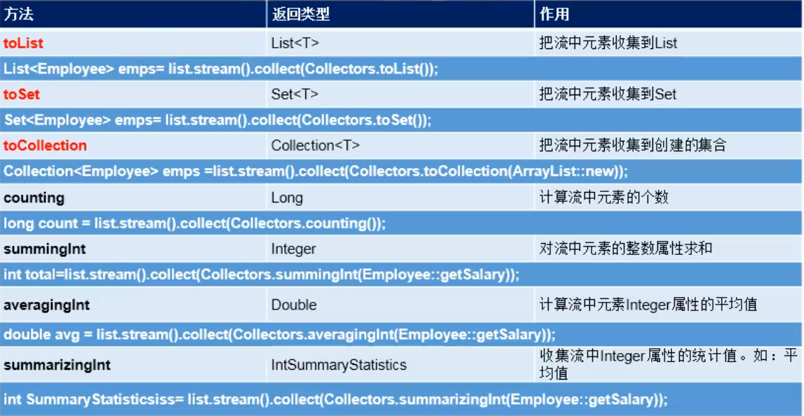
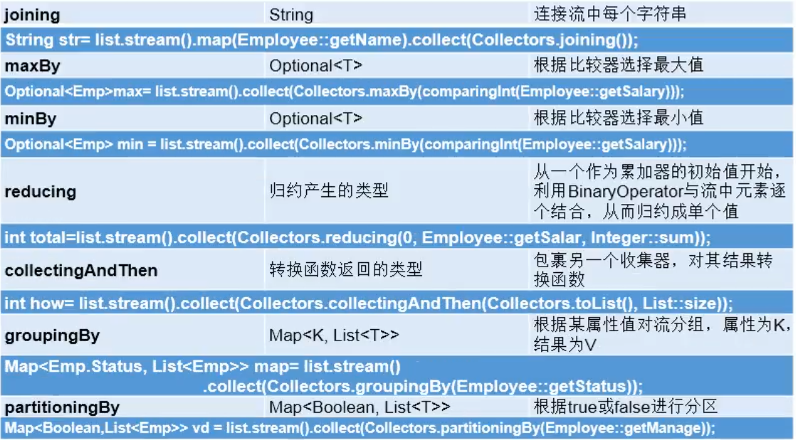

# Stream和Collection集合有什么区别

- Collection集合相当于一个内容容器，是一种静态的内存数据结构。而Stream是有关计算的。前者面向内存，储存在内存，后者主要面向CPU，通过CPU实现
- Stream是不确定的，他的东西是要计算出来的，是属于惰性计算。


# Stream是什么

是数据渠道，用于操作数据源（集合，数组等）所生成的元素序列

**集合讲的是数据，Stream讲的是计算**

<font coloe="red" size="5">***注意***：</font>

- Stream自己不回存储元素
- Stream不回改变源对象。相反，他们会返回一个持有结果的新Stream。
- Stream操作是延迟执行。这意味着他们会等到需要结果的时候才执行。


# 并行流和串行流

Stream API可以生明性地通过parallel() 与 sequential() 在并行流和串行流之间切换

数组工具类Arrays.parallelSort(numbers);


# Stream操作三步骤

## 1. 创建Stream

一个数据源（如：集合、数组），获取一个流


### 创建对象四种方式：

#### 方法一：通过集合来创建

> ***Java8中Collection接口被扩展，提供了两个获取流的方法：***
>
> `default Stream<E> stream();` : 返回一个顺序流
>
> `default Stream<E> parallelStream();` ：返回一个并行流

```java
ArrayList<Integer> is = new ArrayList<>();
is.add(1);
is.add(2);
is.add(3);
is.add(4);
is.add(5);
// 顺序流，指的是在执行一个操作的时候按集合的顺序的去运算执行。
Stream<Integer> stream = is.stream();
// 并行流：指的是在执行一个操作的时候就像线程一样多个一起去操作数据
Stream<Integer> parallelStream = is.parallelStream();
```

#### 方法二：通过数据来创建

> Java8中的Arrays的静态方法stream()可以获取数据流
>
> `static <T> Stream<T> stream(T[] array)`;

```java
Integer[] integers = {1, 2, 3, 4, 5};
Stream<Integer> stream = Arrays.stream(integers);
```

#### 方法三：通过Stream类本身的of()

> `public static<T> Stream<T> of(T... values)` ：返回一个流

```java
Integer[] integers = {1, 2, 3, 4, 5};
Stream<Integer> stream = Stream.of(1,2,3,4,5,6);
```


#### 方法四：创建无限流

> - 迭代
>
> `public static<T> Stream<T> iterate(final T seed,final UnaryOperator<T> f);`
>
> - 生成
>
> `public static<T> Stream<T> generate(Supplier<T> s);`

```java
// public static<T> Stream<T> iterate(final T seed,final UnaryOperator<T> f);
//遍历前10个偶数
Stream.iterate(0, t -> t + 2).limit(10).forEach(System.out::println);

// 输出10个随机数
// public static<T> Stream<T> generate(Supplier<T> s);
Stream.generate(Math::random).limit(10).forEach(System.out::println);
```


## 2. 中间操作

一个中间操作链，对数据源的数据进行处理。

> 多个中间操作可以连接起来形成一个流水线，除非流水线上出发终止操作，否则<font color="red" size="4">**中间操作不会执行任何处理!而在终止操作时一次性全部处理，成为“惰性求值”**
> </font>

### 1.筛选与切片

| 方法                | 描述                                                         |
| ------------------- | ------------------------------------------------------------ |
| filter(Predicate p) | 接受lambda，从流中排除某些元素                               |
| distinct()          | 筛选，通过流生成元素的hashCode()和equals()去除重复元素       |
| limit(long maxSize) | 阶段流，使其元素不超过给定数量                               |
| skip(long n)        | 跳过元素，返回一个扔掉了前n个元素的流。若流中元素不足n个。则返回一个空流。与limit(n)互补 |

***POJO***

    public class Employee {
        Integer id;
        String name;
        Integer age;
        Double salary;
        public Employee() {
        }
    
        public Employee(Integer id) {
            this.id = id;
        }
    
        public Employee(Integer id, String name) {
            this.id = id;
            this.name = name;
        }
    
        public Employee(Integer id, String name, Integer age, Double salary) {
            this.id = id;
            this.name = name;
            this.age = age;
            this.salary = salary;
        }
    
        public Integer getId() {
            return id;
        }
    
        public void setId(Integer id) {
            this.id = id;
        }
    
        public String getName() {
            return name;
        }
    
        public void setName(String name) {
            this.name = name;
        }
    
        public Integer getAge() {
            return age;
        }
    
        public void setAge(Integer age) {
            this.age = age;
        }
    
        public Double getSalary() {
            return salary;
        }
    
        public void setSalary(Double salary) {
            this.salary = salary;
        }
    }
#### 使用

```java
//filter(predicate p) 接收lambda，从流中排除某些元素
//查询员工表中工资大于7000的员工信息
list.stream().filter(e -> e.getAge() > 7000).forEach(System.out::println);
System.out.println();

//limit(n)截断流，使其元素不超过给定数量
list.stream().limit(3).forEach(System.out::println);
System.out.println();

//skip(n)跳过元素，返回一个丢掉了前n个元素的流，若流中不足n，则返回一个空的流
list.stream().skip(3).forEach(System.out::println);
System.out.println();

//distinct()筛选，通过流所生成元素的hashCode()和equals()方法，去除重复元素
list.stream().distinct().forEach(System.out::println);
```

### 2.映射

| 方法                                               | 描述                                                         |
| -------------------------------------------------- | ------------------------------------------------------------ |
| <font color="red">***map(Function f)***</font>     | 接收一个函数作为参数，该函数会被应用到每个元素上，并将其映射成一个新的元素。（简单来说就是每一个元素都会执行函数的逻辑，并且返回一个新的元素) |
| mapToDouble(ToDoubleFunction f)                    | 接收一个函数作为参数，该函数会被应用到每个元素上，产生一个新的DoubleStream |
| mapToInt(ToIntDunction f)                          | 接收一个函数作为参数，该函数会被应用到每个元素上，产生一个新的IntStream |
| mapToLong(ToLongFunction f)                        | 接收一个函数作为参数，该函数会被应用到每个元素上，产生一个新的LongStream |
| <font color="red">***flatMap(Function f)***</font> | 接收一个函数作为参数，将流中每个值都换成另一个流，然后把所有流连成一个流 |

#### map和flatMap的区别

- 跟list.add()和list.addAll() 差不多，如果list1.add(list2)，那么list2会被当成一个元素放入list1。而list1.addAll(list2)，则list2的元素会被拿出来，放入到list1中。
- map里面如果放的是一个流，那么流会被当成一个元素。flatMap的话则是把流里面的东西拿出来，形成一个新的流

#### **使用**

```java
public class StreamApi {

    public static void main(String[] args) {

        // map(Function f)接收一个函数作为参数...
        List<String> list = Arrays.asList("aa", "bb", "cc", "dd");
        list.stream().map(String::toUpperCase).forEach(System.out::println);

        System.out.println();
 
        //练习1
        //获取员工姓名长度大于6的员工姓名
        List<Employee> list1 = Employee.getEmployee();
        list1.stream().filter(emp -> emp.getName().length() > 6).map(Employee::getName).forEach(System.out::println);

        System.out.println();

        //练习2：这里是一个Stream构成的Stream
        Stream<Stream<Character>> streamStream = list.stream().map(StreamApi::fromStringToStream);
        streamStream.forEach(s -> s.forEach(System.out::println));

        System.out.println();

        //练习2升级：flatMap(Function f)
        Stream<Character> characterStream = list.stream().flatMap(StreamApi::fromStringToStream);
        characterStream.forEach(System.out::println);

    }

    //将字符串中的多个字符构成的集合转换成Stream流
    public static Stream<Character> fromStringToStream(String str) {
        ArrayList<Character> list = new ArrayList<>();
        for (Character c : str.toCharArray()) {
            list.add(c);
        }
        return list.stream();
    }

}
```


### 3.排序

| 方法                   | 描述                                 |
| ---------------------- | ------------------------------------ |
| sorted()               | 产生一个新的流，其中按自然顺序排序   |
| sorted(Comparator com) | 产生一个新的流，其中按比较器顺序排序 |

```java
    public static void main(String[] args) {

        // sorted()自然排序
        List<Integer> list = Arrays.asList(12, 13, 143, 543, 67, -98, 123, 7);
        list.stream().sorted().forEach(System.out::println);

        System.out.println();

        // 抛出异常，原因是没有实现排序Comparable接口
        List<Employee> employees = Employee.getEmployee();
//        employees.stream().sorted().forEach(System.out::println);


        // 要么按照自定义排序
        // sorted(Comparator com) 定义排序
       	employees.stream()
            .sorted(Comparator.comparingInt(Employee::getAge))
            .forEach(System.out::println)
    
        employees.stream()
            .sorted((s1,s2) -> Integer.compare(s1.getAge(),s2.getAge()))
            .forEach(System.out::println);
    }
```


## 3.终止操作(终端操作)

<font color="red" size="4">**一旦执行终止操作，就执行中间操作链**</font>，并产生结果。之后，不会再被使用。

- 终止操作会从流的流水线生成结果。其结果可以是任何不适流的值，例如：List、Integer甚至是void。
- 流进行了终止操作后，不能再次使用。

### 1.匹配与查找

| 方法                   | 描述                                                         |
| ---------------------- | ------------------------------------------------------------ |
| allMatch(Predicate p)  | 检查是否匹配所有元素                                         |
| anyMatch(Predicate p)  | 检查是否至少匹配一个元素                                     |
| noneMatch(Predicate p) | 检查是否没有匹配所有元素                                     |
| findFirst()            | 返回第一个元素                                               |
| findAny()              | 返回当前流中任意元素                                         |
| count()                | 返回流中元素总数                                             |
| max(Comparator c)      | 返回流中元素最大值                                           |
| min(Comparator c)      | 返回流中元素最小值                                           |
| forEach(Consumer c)    | 内部迭代（使用Collection接口需要用户去做迭代，称为外部迭代。相反，Stream API 使用内部迭代——它帮你把迭代做了） |

```java
public class StreamApi {

    public static void main(String[] args) {
        List<Employee> employee = Employee.getEmployee();

        //allMatch(Predicate p) 检查是否匹配所有元素
        //是否所有的员工的年龄都大于18岁
        var a = employee.stream().allMatch(e -> e.getAge() > 18);
        System.out.println(a);

        //anyMatch(Predicate p) 检查是否至少匹配一个元素
        boolean b = employee.stream().anyMatch(e -> e.getAge() > 18);
        System.out.println(b);

        //noneMatch(Predicate p) 检查是否没有匹配的元素
        //练习，是否存在员工名字姓z
        boolean noneMatch = employee.stream().noneMatch(e -> e.getName().startsWith("z"));
        System.out.println(noneMatch);

        //findFirst() 返回第一个元素
        Optional<Employee> first = employee.parallelStream().findFirst();
        System.out.println(first);

        //findAny 返回当前流中任意元素(最快处理完的线程的元素)
        Optional<Employee> any = employee.parallelStream().findAny();
        System.out.println(any);

        //count 返回六中元素的总个数
        long count = employee.parallelStream().count();

        //max(Comparator c) 返回流中最大值
        //练习：返回最高工资
        Optional<Double> max = employee.parallelStream().map(Employee::getSalary).max(Double::compareTo);
        System.out.println(max);


        //min(Comparator c)返回流中最小值
        //练习：返回最低工资员工
        Optional<Employee> min = employee.parallelStream().min(Comparator.comparingDouble(Employee::getSalary));
        System.out.println(min);
        //forEach(Consumer c) 内部迭代
        //这是stream操作
        employee.stream().forEach(System.out::println);
        //这是集合的普通的方法
        employee.forEach(System.out::println);

    }

}
```


### 2.归约

> map和reduce的连接通常称为map-reduce模式，因Google用它来进行网络搜索而出名

| 方法                            | 描述                                                         |
| ------------------------------- | ------------------------------------------------------------ |
| reduce(T iden,BinaryOperator b) | 可以将流中元素反复结合起来，得到一个值。返回T，==参数一是初始值，参数2是操作== |
| reduce(BinaryOperator b)        | 可以将流中元素反复结合起来，得到一个值。返回Optional\<T>     |

```java
public static void main(String[] args) {

        //reduce(T iden,BinaryOperator b)可以将流中元素反复结合起来，得到一个值。返回T
        //练习1：计算1-10的自然数的和
        //方法一
        List<Integer> list = Arrays.asList(1, 2, 3, 4, 5, 6, 7, 8, 9, 10);
        int sum = list.stream().mapToInt(i -> i).sum();
        // 我们看sum源码，也是用了reduce()
        System.out.println(sum);
        System.out.println();
        //方法二,参数一：初始值
        list.stream().reduce(0, Integer::sum);
        System.out.println(sum);
        //reduce(BinaryOperator b)可以将流中元素反复结合起来，得到一个值。返回Optional<T>
        //练习二：计算公司中所有员工的工资总和
        List<Employee> empList = Employee.getEmployee();
        Optional<Double> reduce = empList.stream().map(Employee::getSalary).reduce(Double::sum);
        System.out.println(reduce);
    }
```


### 3.收集

> Collector接口中方法的实现决定了如何对流执行收集的操作（如手机到List，Set，Map）。

| 方法                 | 描述                                                         |
| -------------------- | ------------------------------------------------------------ |
| collect(Collector c) | 将流转换为其他形式。接收一个Collector接口的实现，用于给Stream中元素做汇总的方法。 |

>  另外，Collectors实用类提供了很多静态方法，可以方便地创建常见收集器实例，具体方法与实例如下表：

#### Collectors





```java
 //collect(Collector c)
        // 联系1：查找工资大于6000的员工，返回一个list或set
        List<Employee> employee = Employee.getEmployee();
        List<Employee> list = employee.stream().filter(e -> e.getSalary() > 6000).collect(Collectors.toList());
        list.forEach(System.out::println);

        Set<Employee> set = employee.stream().filter(e -> e.getSalary() > 6000).collect(Collectors.toSet());
        set.forEach(System.out::println);
```

