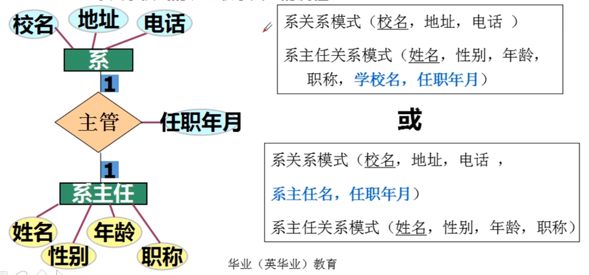

[toc]


# 考试介绍

## 题目类型


## 课程大纲


**说明**

- 前三章偏向理论，考试要写出来的东西都是这三章出的。
- 4-6，偏应用，笔试比分也多，应用题在这里出
- 7，如何做实际应用
- 8，理论题会出，不难，了解一下。

**考试**

考试分为==笔试==和==实验考核==两部分，笔试闭卷150分钟，实验由各地主考学校自行安排进行(简单一些)

**考试题型**

单选，多做就好

填空，多做不一定可以

简答，书上概念性的东西，把书上的点写出来就行，不用展开

设计，E-R图，或者根据E-R图画出关系模型，表结构

综合，CRUD，索引，触发器，视图

**实验**

p18，1，命令行增加数据库和表，对表进行增删改查，增加完整性约束和访问控制，数据库备份和回复，编写存储过程、存储函数，触发器。2，使用php开发一个简单的mysql应用程序

> 知识点：基本概念（元组等），表，映射，视图，DML，存储过程、存储函数，触发器

# 第一章-数据库系统原理

## 第一节数据库基本概念

### 1.数据

数据是==描述事物的符号记录，是指用物理符号记录下来的、可鉴别的信息。==

包括数字、字母、文字、特殊字符组成的文本数据，也可以是图形、图像、动画、影响、声音等多媒体数据。

> 数据和信息的区别，数据是杂乱的，经过加工之后才能变成信息，而信息是有价值的。

### 2.数据库

数据库是==长期存储在计算机中的有组织的、可共享的数据集合==

*数据库中存储的数据*具有==永久存储、有组织和可共享==**三个基本特点** 

### 3.数据库管理系统

数据库管理系统，是专门用于建立和管理数据库的一套软件，介于==应用程序和操作系统==之间

**(1)数据定义**

提供数据定义语言(DDL)，定义表，视图，存储过程，触发器等。

**(2)数据操纵**

提供数据操纵语言(DML data manipulation language),操纵数据库中的基本数据，包括查询、插入、删除和修改等。

**(3)数据库的运行管理**

保证数据库的安全性、完整性、多用户对数据的并发使用以及发生故障后的系统恢复

**(4)数据库的建立和维护**

创建数据库、对数据库的空间维护、数据库的备份与恢复、数据库的重组织和性能监听、分析等。

**(5)数据组织、存储和管理**

例如：索引查找、顺序查找等

**(6)其他功能**

主要包括 其他软件的网络通信功能、不同数据库管理系统之间的数据传输以及相互访问功能等。

### 4.数据库系统

==数据库是指在计算机中引入数据库技术之后的系统==。通常，一个完整的数据库系统包括数据库、数据库管理系统及相关实用工具、应用程序、数据库管理员和用户。

## 第二节-数据管理技术的发展

### 一、人工管理阶段

#### **特点**

1. 数据不保存
2. 使用应用程序管理数据
3. 数据面向应用

ps：记录内无结构，整体无结构


### 二、文件系统阶段(我的电脑)

#### **特点**

- 数据的管理者：文件系统，数据可长期保存
- 数据面向的对象：某一应用程序
- 数据的共享程度：共享性差、冗余度大
- 数据的结构化：记录内有结构，整体无结构
- 数据的独立性：独立性差，数据的逻辑结构改变必须修改应用程序
- 数据控制能力：应用程序自己控制。

### <font color=red>三、数据库系统阶段</font>

#### <font color=red>**特点**</font>

1. 数据集成
2. 数据共享度高
3. 数据冗余度小
4. 数据一致性
5. 数据独立性高
6. 实施统一管理与控制
7. 减少应用程序开发与维护的工作量

ps：数据由于集成在一个地方，所以独立出来了，独立的东西冗余度小，自然一致性高，方便共享，比较好实施统一的管理和控制，能减少程序开发与维护的工作量


## 第三节-数据库系统的结构

### 一、数据库系统的三级模式<font color=red>(考一些概念或者选择题)</font>

#### **1.模式**

模式也称为==概念模式或逻辑模式==，它是数据库中全体数据的逻辑结构或特征的描述，是所有用户的公共数据视图

一个数据库只有一个模式，且相对稳定（其实就是有一个统一的规则）

> E-R图是概念模式，表是逻辑模式

#### **2.外模式**

外模式也称==子模式或用户模式==，它是数据库用户（包括应用程序员和最终用户）能够看见和使用的局部数据的逻辑结构和特征的描述，是与某一应用有关的数据的逻辑表示。

DBMS提供子模式描述语言(Subschema DDL)来严格定义子模式

> 每个人员能够看到的东西不一样，经理能够看成本价，而其他人只能看到普通的信息，这就是外模式

#### **3.内模式**

内模式也称为==存储模式==（Storage Schema），是对数据库中数据==物理结构和存储方式==的描述，是数据在数据库内部的变现形式

> 一般用户是看不到的，只有数据库管理员才会搞这个 ，这个数据在E盘怎么存储啊，建什么索引啊，之类的底层的东西。 

#### **4.三级模式结构的两层映像与数据独立性**

##### （1）外模式/模式映像（逻辑独立性）

##### （2）模式/内模式映像（物理独立性）

> 逻辑独立性就是修改数据库的东西，用户不需要修改，不需要操作，这叫逻辑的独立性。
>
> 物理独立性就是增加服务器，程序员感受不到。 

##### **三级模式和两层映像的含义 **

数据库的三级模式是指数据库系统是由模式、外模式和内模式构成的三级功能，对应数据库的三级抽象。

两层映像是指三级模式之间的映像关系，即外模式/模式映像，实现的是逻辑独立性，模式/内模式映像，实现的是物理独立性。

### 二、数据库系统的运行与应用结构

#### 1.客户/服务器(Client/Server,C/S)模式

例如：QQ、桌面客户端游戏

#### 2.浏览器/服务器(Browser/Server,B/S)模式

例如：网站，在线web游戏


## 第四节-数据模型

### 一、数据特征与数据模式的组成要素

对现实世界数据特征进行抽象的数据模式，需要描述数据的静态特征和动态行为。

#### **数据模型的组成要素**

1. ##### 数据结构

   描述系统的==静态特征==，即数据对象的数据类型、内容、属性及数据对象之间的联系

2. ##### 数据操作

   描述系统的==动态特征==，是对各种对象实例允许执行的操作集合，包括操作及有关的操作规则。

3. ##### 数据约束

   描述数据结构中数据间的==语法和语义关联==，包括相互制约与依存关系及数据动态变化规则，以保证数据的正确性、有效性和相容性。

### 二、数据模型的分类


#### **1.概念层数据模型**

##### (1)信息世界中的基本概念

###### ①实体

客观存在并可相互区别的事物称为实体。如学生、部门、课程等。

###### ②属性

实体所具有的特征。如学生具有学号、姓名、性别等特性。

###### ③码或键

可唯一标识实体的==属性集==。如学号是学生实体的码或键

###### ④域

属性的取值范围。如性别的域为(男，女)

###### ⑤实体型

用实体名与属性名的集合标识同类实体，称为实体型如∶学生（学号、姓名、性别、出生日期)

###### ⑥实体集

同型实体的集合称为实体集。如︰每个学生是一个实体，所有的学生构成一个实体集

###### ⑦联系

实体（型)内部之间的联系和实体（型)之间的联系

—对一1:1
—对多:1:N
多对多:M∶N

#### <font color=blue>**（2）概念模型的表示方法**</font>


### **2.逻辑层数据模型**

1. 层次模型（资源管理器）
   1. 层次模型是数据库系统最早使用的一种数据模型，它的数据结构是一颗“有向树”，树的每个节点对应一个记录集，也就是现实世界的实体机。层次模型的特点是：有且仅有一个节点没有父节点，他称作根节点
2. 网状模型
3. ==关系模型==（关系型数据库）
4. 面向对象模型

> 关系模型与网状模型、层次模型的区别，p41

结构不一样，关系模型使用二维表结构表示实体及实体间的联系，层次模型则是“有向树”，树的每个节点都对应一个记录点，网状模型是层次模型的扩展，他允许一个节点有多个父节点，或者一个以上节点没有父节点。

关系模型建立在严格的数据概念的基础上。

概念单一，统一用关系来表示实体以及实体间的联系，对数据的检索和更新结果同样也是用关系（即表）来表示。因而，关系模型的数据结构简单、清晰，用户易懂易用。

关系模型的存取路劲对用户透明，从而具有更高的数据独立性、更好的安全保密性，也简化了程序员的工作和数据库开发建立的工作。


**~~3.物理层数据模型~~**
也称为数据的物理模型( Physical Model )，描述数据在存储介质上的组织结构，是逻辑模型的物理实现，即每一种逻辑模型在实现时都要有与其相对应物理模型。
物理模型是数据库最底层的抽象，它确定数据的物理存储结构、数据存取路径以及调整、优化数据库的性能。
物理模型的设计目标是提高数据库性能和有效利用存储空间。
物理数据结构一般都向用户屏蔽，用户不必了解其细节。

## 课后问答题

- 数据、数据库、数据库管理系统、数据库系统的概念

- 数据管理技术中，与人工管理、文件系统相比，数据库系统的优点

- 数据库系统的三级模式和两层映射的含义

- 关系模型与网状模型、层次模型的区别

# 第二章-关系数据库

## 第一节-关系数据库的概述（了解）

**系统而严格地提出关系模型的是美国IBM公司的E.F.Codd**

**1.1970年提出关系数据模型;**
**2.E.F.Codd**，《A Relational Model of Data for LargeShared Data Banks》,1970
3.之后，提出了关系代数和关系演算的概念4.1972年提出了关系的第一、二、三范式5.1974年提出了关系的BC范式

**关系数据库应用数学方法来处理数据库中的数据**
80年代后，关系数据库系统成为最重要、最流行的数据库系统

典型的实验系统:
System R、University INGRES

典型的商用系统:
Oracle、Sybase、Informix、IBM DB2、MS SQL ServerPC

端小型数据库系统∶
Foxpro、Access、MySql


## 第二节-关系数据模型

### 一、关系数据结构

关系模型的数据结构非常简单，只包含单一的数据结构，即关系。

在用户看来，关系模型是二维表格


#### **关系数据库的基本术语：**

##### **1.表(Table )**

表，也称==关系==，是一个二维的数据结构，由表名、列、行数据构成。每个表的表名唯一，每一行描述一条具体的记录值。

##### **⒉关系(Relation )**

同表。关系有三种类型:==基本关系、查询表和视图表==

##### **3.列( Column )**

表中的列，也称作==字段==(Field )或==属性==(Attribute ) ，每一列有一个名称，称为列名、字段或属性名

##### **4.属性(Attribute )**

同列。

##### **5.行(Row )**

也称元组(Tuple )或记录( Record ) ，一行数据即一个元组或一条


##### **6.元组(Tuple)**

同行。

##### **7.分量(Component )**

元组中的一个属性值成为分量。

##### **8.码或键(Key )**

能用来唯一标识一行数据的属性或属性组，如学号、身份证号等9.超码或超键(Super Key )
如果一个关系中的一个码移去某个属性，它仍然是这个关系的码，则这样的码或键为该关系的超码或超键。
如（学号，姓名)、（学号，姓名，性别)、（学号，姓名，性别，出生日期）等

##### **10.候选码或候选键( Candidate Key )**

如果在关系的一个码或键中，不能移去任何一个属性，否则它就不是这个关系的码或键。如（学号，课程号)

##### **11.主码或主键( Primary Key )**

指定==一个==候选码来唯一标识一行数据。

##### **12.全码或全键(All-Key )**

一个关系中所有属性都是（可以是）主码或主键，也就是每一个都是候选码

##### **13.主属性( Primary Attribute )和非主属性(NonPrimaryAttribute )**

包含任何一个候选码的属性称为主属性，不包含任何一个候选码的属性称为非主属性

##### **14.外码或外键(Foreign Key )**

某个属性不是这个关系的主码或候选码，而是另一个关系的主码，则该属性是外码。
如︰学生(学号，姓名，性别，出生日期，班主任，教师工号)
教师(工号，姓名，性别，出生日期)

##### **15.参照关系和被按照关系**

以外码作为主码的关系成为被参照关系外码所在的关系称为参照关系

##### **16.域(Domain )**

表示属性的取值范围，如“性别”取（男，女)

##### **17.数据类型**

表示属性的数据类型，如“性别”为字符型，“工资”为货币型

##### **18.关系模式**

**关系模式**是静态的，关系是动态的
**关系是关系模式在某一时刻的状态或内容**

关系模式：学生(学号，姓名，性别，出生日期，班主任，教师工号) 

关系：

关系模式就是字段名，字段名是不变的 

##### **19.关系数据库**

关系数据库是以关系模型作为数据的逻辑模型，并采用关系作为数据组织的一类数据库，其数据操作建立在关系代数的基础上。

##### ext.复合主键|联合主键（不明确

> [什么是复合主键](https://www.cnblogs.com/stilldream/p/10435628.html)
>
> [ 数据库中复合主键与联合主键的区别？_跟着BOSS有肉吃-CSDN博客](https://blog.csdn.net/a15028596338/article/details/86363875)

主键是唯一的索引，通常会用GUID最为主键，但是并不是每个表都存在ID字段，例如学生表（姓名，生日，性别，班级），这里面每一个值都可能重复，无法使用单一字段作为主键，这时我们可以将多个字段设置为复合主键，由复合主键标识唯一性。只要不是复合主键每个值都重复，就不算重复。

#### **不是任意一个二维表都是关系，关系有下列要求∶**

1. 每个属性都是不可分解的
2. 每一个关系模式中属性的数据类型以及属性的个数是相对固定的
3. 每一个关系模式中的属性必须命名，且不同
4. 同一个关系中不允许出现候选码相同的两行
5. 行可任意交换
6. 列可任意交换

### 二、关系操作集合

### **1.基本的关系操作**

**查询类:**==选择、投影、连接、除、并、差、交、笛卡尔积等==
**数据更新类∶**==插入、删除、修改==
查询的表达能力很强，是其中最主要的部分
关系操作的特点∶
集合操作方式，即操作的对象和结果都是集合

### **2.关系数据语言的分类**（不会出题）

关系操作分为==代数方式==和==逻辑方式==
代数方式主要是==关系代数==，通过对关系的操作来表达查询要求的方式
逻辑方式主要是==关系演算==，使用谓词来表达查询要求的方式
具有关系代数和关系演算双重特点的语言:==SQL== ( Structured Query Language，结构化查询语言)

### **3.关系代数**

#### **A.传统的集合运算**


##### **(1)并**

两个集合并起来，相同的变成一条


##### (2)差

S1-S2，两表相同的减去

##### (3)交

两者相交

##### (4)笛卡尔积


每一条S1的数据和每一条S2的数据合并起来

#### B.专门的关系运算

选择、投影、链接、除

##### (1)选择(SELECT)

选择是从指定的关系中选取满足条件的若干==元组==组成的一个新的关系
==SELECT关系名 WHERE条件==
其中，条件是由常数、属性名或列名、比较操作符及逻辑操作符组成的条件表达式
比较操作符:`>`，`>`，`<`,`≤`，`=`或`<>`

逻辑运算符:

##### (2)投影（PROJECTION）

**投影是从指定的关系中选取指定的若干==属性值==组成的一个新的关系**

==Projection关系名（属性名1，属性名2，... ，属性名n )==

例如:从表2.9中的S1中找出学生宿舍分配情况:
Projection S1(学号，宿舍)


##### (3)连接（JOIN)

连接也称为θ连接，θ：比较运算符
连接运算从R和S的广义笛卡尔积R×S中选取（R关系)在A属性组上的值与(S关系)在B属性组上值满足比较关系的元组。
==JION 关系名1 and关系名2 where 条件==

- 等值连接:0为“=”的连接运算称为等值连接
- 两个关系中进行比较的分量必须是相同的属性组，在结果中把重复的属性列去掉

##### ==(4)除(DIVISION )==

> 笛卡尔积的逆

除的关系表示为R÷S
其中R和S代表两个不同的关系。在除的运算中，若被除关系为m元关系，除关系为n元关系，则运算结果为一个m-n元关系。

### 三、关系的完整性约束

#### 1.实体完整性约束

关系的主属性，即主码的组成不能为空，也就是关系的主属性不能是空值NULL。

主键(主码）不能为空
如︰学生(学号，姓名，性别)，学号为主码，不能为NULL

#### ⒉.参照完整性约束

> 就是必须有外键

若属性或属性组F是基本关系R的外码，与基本关系S的主码K相对应，则对于R中每个元祖在F上的取值只允许有两种可能，要么是空值，要么与S众某个元组的主码值相对应。

实体之间存在联系
教师(职工号，姓名，性别，职称，系编号)系（系编号，系名，办公地点，办公电话)

#### 3.用户自定义完整性约束

> 比如身份证要限制18位，前几个数据是什么


反映某一具体应用所涉及的数据应满足的要求

#### 4.关系模型完整性约束的检验

> 执行之前要检验各个关系之间的约束

- 执行插入操作
- 执行删除操作
- 执行更新操作


## 第三节-关系数据库的规范化理论

### 一、关系模式中可能存在的冗余和异常问题

#### 1.数据的冗余

>教师的名字在学生表里面进行存储，这时候如果教师的名字改了，学生表中的名字就可能出现问题，这叫做冗余，正常的做法则是存储教师id

#### 2.更新异常

> 假如李小明转系到法律系，那么为了保证数据库中数据的一致性，需要修改三条记录中系与系主任的数据。
>
> 一处改了，另一处没改。——**修改异常。**

#### 3.插入异常

> 假如学校新建了一个系，但是暂时还没有招收任何学生（比如3月份就新建了，但要等到8月份才招生），那么是无法将系名与系主任的数据单独地添加到数据表中去的 （注１）——**插入异常**

#### 4.删除异常

> 假如将某个系中所有学生相关的记录都删除，那么所有系与系主任的数据也就随之消失了（一个系所有学生都没有了，并不表示这个系就没有了）。——**删除异常**


### 二、函数依赖与关键字

#### **定义2.1(不考)**

**设R为任一给定关系，如果对于R中属性X的每一个值，R中的属性Y都==只有==唯一值与之对应，则称X函数决定Y或称Y函数依赖于X，记作x→Y。其中X称为决定因素。**
例如，表2.9中有关学生住宿登记的关系S1中存在如下函数依赖关系:

SNO→SNAME
SNO →SSEX
SNO→SROOM（假定一个学生仅住一间宿舍）

#### 1.完全函数依赖

**定义2.2设R为任一给定关系，X、Y为其属性集，若X→Y，且对X中的任何真子集X'都有X'Y'，则称Y==完全函数==依赖于X**
如:SC (SNO，CNO，CTITLE，INAME，IPLACE，GRADE)

(SNO，CNO)→GRADE为完全函数依赖

> 人没办法决定分数
>
> 科目没办法决定分数
>
> 人和某个科目就能决定分数

#### 2.部分函数依赖

**定义2.3设R为任一给定关系，X、Y为其属性集，若X→Y，且X中存在一个真子集X’满足X’→Y，则称Y==部分函数==依赖于X**
如:在表2.9中，有(SNO，SNAME)→SSEX，但其中SNO→SSEX，因此(SNO， SNAME)→SSEX为部分函数依赖关系

>人和名字都能决定性别
>
>人能决定性别
>
>名字能决定性别（理想化）
>
>个人理解：部分函数依赖与候选关键字不冲突，虽然存在候选关键字时，就存在部分函数依赖，但是如果x,y能决定其他信息，x和y也能单独决定其他信息的同时，x与y都是候选关键字，则没问题。不要像第三范式示例那样，x,y决定z但是又存在y决定非主字段的情况就行。也就是说不要完全函数依赖与部分函数依赖存在于同一张表中。

#### 3.传递函数依赖

**定义2.4 设R为任一给定关系，X、Y、Z为其属性子集，若X→Y，→X，Y→7，则有X→Z。称Z传递函数依赖于X
BNO→PNAME，PNAME→PADDRESS，但PADDRESS  BNO，故PADDRESS对BNO的==传递函数==依赖**

> x决定y，y决定z，但是反过来则不行

#### ==候选关键字== 

定义2.5

设R为任一给定关系，U为其所含的全部属性集合，X为U的子集，若有完全函数依赖X→U，则X为R的一个候选关键字。

> 学号、身份证号都能决定学生信息，所以学号或身份证)就是学生信息的候选关键字，候选关键字有可能是完全函数依赖，也有可能是部分函数依赖
>
> 简单来说就是一个字段决定整张表（类似于主键），一般不把主键算在内


### 三、范式与关系规范化过程

满足最低要求的是第一范式，简称1NF

满足更高的要求:
2NF
3NF 改进 BCNF
4NF
5NF

S=学生

C=课程

I|T=教师

==决定关系为一对一关系==

每个列与列的交叉点的取值都死==不可再分的==基本元素


#### 第二范式（必考）

> ==消除部分函数依赖，变为完全函数依赖。==
>
> 可以理解为部分函数依赖是不好的，把部分函数依赖变成完全函数依赖
>
> 简单来说，==就是不要一张表中出现一个字段z，需要两个字段x,y共同才能决定，但是除了z，还有其他字段，这些字段又由y决定的情况，如果出现这种情况，则把，x,y,z单独一张表。而其他非主属性和y单独一张表。==

定义2.7

设R为任一给定的关系，若R为1NF，且其所有的非主属性都==完全函数依赖==于候选关键字，则R为第二范式。
表2.17中GRADE完全依赖于(SNo，CNO），其他非主属性CTITLE、INAMEIPLACE、都只函数依赖于CNO


> GRADE完全依赖于(SNO,CNO)，这是完全函数依赖
>
> CTITLE完全依赖于(SNO,CNO),CTITLE也完全依赖于SNO，所以这是部分函数依赖。所以要把部分函数依赖给消除。分成两张表

#### 第三范式（必考）

==大多数能解决插入、删除异常，冗余得到控制，表2.22的就没解决插入和删除异常==

> 消除传递函数依赖
>
> 简单来说就是不要在同一张表中，出现两个决定关系，因为出现这样的关系时，会有可能出现删除异常

定义2.8

设R为任一给定的关系，若R为2NF，且其每一个非主属性都不传递函数依赖于候选关键字，则R为第三范式。
表2.19中CNO→INAME，INAME→IPLACE，但INAME  CNO


#### BCNF范式（基本不考）

==解决有时出现的插入和删除异常==

定义2.9

设R为任一给定的关系，X、Y为其属性集，F为其函数依赖集，若R为3NF，且其F中所有函数依赖→Y(Y不属于X）中的X必包含候选关键字，则R为BCNF。
表2.22中TNAME →CTITLE（理想状态），但TNAME不是候选关键字


> 简单来说，就是不要让表中存在非候选关键字能决定另外一个字段的情况出现
>
> ==老师和课程是一一对应的。而学生和老师是属于一对多关系，不要让一对多关系和一对一关系出现在同一表中。==


### 四、关系规范化理论的应用

在概念设计阶段可用规范化理论分析实体划分是否合适，判断属性分配到哪个实体更为合理
在将**E-R图向关系模型转换时**，还可以用它来分析并发现概念设计中可能存在的遗漏或不当之处

## 课后问答题

- 简述关系数据库的基本特征
- 简述什么是参照完整性约束
- 简述关系规范化过程

对于存在数据冗余，插入异常，删除异常问题的关系模式，应采取一个关系模式分解为多个关系模式的方法进行处理。一个低一级范式的关系模式，通过模式分解可以转换成若干个高一级范式的关系模式，这就是所谓的规范化过程


# 第三章-数据库设计

## 第一节-数据库设计概述

### 一、数据库的生命周期

数据库的生命周期分为两个阶段∶
(1）**数据库分析与设计阶段**︰需求分析、概念设计（E-R）、逻辑设计(E-R转表)和物理设计（索引和聚集创建）
(2）**数据库实现与操作阶段**︰数据库的实现（建立数据库）、操作与监督、修改与调整

### 二、数据库设计的目标:

1. 满足应用功能需求

2. 良好的数据库性能
   1. 响应速度，查询速度，安全性

### 三、数据库设计的内容

数据库设计是从用户对数据的需求出发，研究并构造数据库的过程，其包含两个方面的内容∶
(1）数据库结构设计。包括数据库的概念结构设计、逻辑结构设计和物理结构设计
(2）数据库行为设计。增删改查......

### 四、数据库设计的方法

1. 直观设计法

2. 规范设计法
   1. 新奥尔良设计方法
      1. 四个阶段：需求分析，概念结构设计，逻辑设计，物理设计
      2. 注重结构而不注重行为设计
   2. 基于E-R图模型的数据库设计方法
   3. 基于第三范式的设计方法
3. 计算机辅助设计法（画图）

### 五、数据库设计过程


## 第二节-数据库设计的基本步骤

### 一、需求分析

#### 1.确定数据库范围

即确定数据库应该支持哪些功能


#### 2.应用过程分析

应用过程分析是指了解并分析**数据与数据处理间**的关系。
数据应用过程可以借助==数据流程图==或其他信息及应用结构图形表示

#### 3.收集与分析数据

##### (1）静态结构

数据的静态结构是指不施加应用操作于其上时数据的原始状况，这可通过==数据分类表==和==数据元素表==进行说明

##### (2）动态结构

动态结构是指将应用操作施加于数据之上后数据的状况，可通过==任务分类表==和==操作特征表==进行说明

##### (3）数据约束

数据约束是指使用数据时的特殊要求。

- 数据的安全保密性
- 数据的完整性
- 响应时间
- 数据恢复

#### 4.编写需求分析报告

需求分析报告通常包括的内容有∶

1. 数据库的应用功能目标

2. 标明不同用户视图范围

   1. 用户视图，不同用户能看到的东西

3. 应用处理过程需求说明
   数据流程图、任务分类表、数据操作特征表、操作过程说明书

4. 数据字典
   数据字典通常包括数据分类表、数据元素表和各类原始资料

   把字段的各种资料都放到备注里面去

5. 数据量
   静态数据量、动态数据量

   预测

6. 数据约束

### 二、概念结构设计

概念结构设计的任务是在需求分析中产生的需求分析报告的基础上，按照特定的方法设计满足应用需求的用户信息结构，该信息结构通常称为概念模型。
其中，采用==E-R图==作为概念模型的描述工具

### 三、逻辑结构设计


模型转换（表），子模式设计（视图），应用程序设计说明这三个属于逻辑结构设计

### 四、物理设计

物理设计是指对于一个给正的数据库逻辑结构，研究并构造物理结构的过程，其具体的任务主要是确定在存储设备上的**存储结构及其存取方法**，因DBMS的不同还可能包括**建立索引和聚集**，以及**物理块大小、缓冲区个数和大小、数据压缩的选择**等。

### 五、数据库实施

1. 加载数据
   将符合要求的初始数据装载到数据库中去，包括数据的收集、分类、整理校验和输入等过程
2. 应用程序设计
3. 数据库试运行

### 六、数据库运行和维护

只有经过试运行之后，确认系统无故障或暂未发现故障时，系统才能投入到生产实际中运行。
数据库系统投入运行标志着数据库设计和应用开发的基本完成，但绝不意味着设计和开发工作的终止。
系统维护中最困难的工作是数据**库重组和重构**。

## 第三节-关系数据库设计方法

### 一、关系数据库设计过程与各级模式


### 二、概念结构设计方法

#### 1.E-R图的表示方法

##### （1）两个实体之间的联系


##### （2）两个以上实体之间的联系


##### （3）单个实体型内的联系


#### 2.局部信息结构设计（建议先画局部）

1. 确定局部范围
2. 选择实体
3. 选择实体的关键字属性
4. 确定实体间的联系
5. 确定实体的属性


#### 3.全局信息结构设计

**各局部E-R图之间的冲突主要表现在三个方面︰**

1.属性冲突

- 属性域冲突
- 属性取值单位冲突

2.命名冲突

- 同名异义
- 异名同义

3.结构冲突

- 同一对象在一个局部E-R图中作为实体，而在另一个局部E-R图中作为属性
- 同一实体在不同E-R图中属性个数和类型不同
- 实体之间的联系在不同E-R图中是不同的类型


### 三、逻辑结构的设计方法

#### 1.E-R图向关系模型的转换(必考)

E-R模型向关系模型的转换规则:

##### （1）实体类型的转换

将每个实体类型转换成一个关系模式，**实体的属性即为关系的属性，实体标识符即为关系的键**。

##### （2）联系类型的转换

######        1）实体间的联系是1：1

> 联系是一对一时，中间的关系就不需要转换成为字段（实际开发中，为了方便拓展，最好还是转)

~~可以~~在两实体类型转换成两关系模式中的==任意==一个关系模式的属性中加入**另一个关系模式的键**和**联系类型的属性**。



######     2）如实体间的联系是1：N

> 一对多，中间联系的属性放多那边去

则在N端实体类型转换成的关系模式中加入==1端实体类型==转换成的关系模式的键和联系类型的属性。


######       3)如实体间的联系是M:N

> 多对多，中间联系变成表

则将联系类型也转换成关系模式，其属性为两端实体类型的键加上联系类型的属性，而键为两端实体键的组合。


#### 2.数据模型的优化

1. 确定各属性间的函数依赖关系
2. 对于各个关系模式之间的数据依赖进行极小化处理，消除冗余的联系
3. 判断每个关系模式的范式，根据实际需要确定最合适的范式
4. 按照需求分析阶段得到的处理要求，分析这些模式对于这样的应用环境是否合适，确定是否要对这些模式进行合并或分解

#### 3.设计用户子模式

利用==视图( View)==设计更符合局部用户需要的用户外模式

##### 视图优点

1. 利用视图重新定义某些属性的别名
2. 对不同级别的用户定义不同的视图
3. 监护用户对系统的使用，如将复杂查询定义为视图等

### 四、物理设计方法

#### 1.建立索引

> 索引就相当于是目录。

#### 2.建立聚集

> 将相同类型，经常查阅的频率高的数据，弄到一块存储到硬盘中。

## 课后问答

- 简述数据库设计的基本步骤

  - 需求分析，概念结构设计，逻辑结构设计，物理结构设计，数据库数据库实施，数据库的运行和维护

- 分别举例说明实体之间联系的三种变现形式

  - 一对一联系∶对于实体集A中的每个实体，实体集B中最多只有一个实体与之联系，反之亦然。举例︰班级与班长，每个班只有一个班长，每个班长也只在一个班内任职。
  - 一对多联系:对于实体集A中的每个实体，实体集B中有N个实体与之联系，反之，对于实体集B中的每个实体，实体集A中最多只有一个实体与之联系。举例:班级与班级成员，每个班级对应多个班级成员，每个班级成员只对应个班级。
  - 多对多联系∶对于实体集A中的每个实体，实体集B中有N个实体与之联系反之，对于实体集B中的每个实体，实体集A中有M个实体与之联系。举例授课班级与任课教师，每个班级对应多名任课教师，每个任课教师也对应多个授课班级。

- 简述基本E-R图向关系模型转换的原则

  1)**一个实体型转换为一个关系模式**。实体的属性作为关系的属性，实体的码作为关系的码。
  2)一个一对一联系(1∶1)**可以转换为一个关系模式**，也可以与任意一端对应的关系模式合并。如果转换为一个独立的关系模式，则与该联系相连的各实体的码以及联系本身的属性均转换为关系的属性，每个实体的码均是该关系的候选码﹔如果与某一端实体对应的关系模式合并，则需要在该关系模式的属性中加入另一个关系模式的码和联系本身的属性。
  3 )一个一对多联系(1:N)**可以转换为一个独立的关系模式**，也可以与N端对应的关系模式合并。如果转换为一个独立的关系模式，则与该联系相连的各实体的码以及联系本身的属性均转换为关系的属性，而关系的码为N端实体的码。
  4)一个多对多联系(M:N)**转换为一个关系模式**。与该联系相连的各实体的码以及联系本身的属性均转换为关系的属性，关系的码为各实体码的组合。
  三个或三个以上实体间的一个多元联系可以转换为一个关系模式。与该联系相连的各实体的码以及联系本身的属性均转换为关系的属性，关系的码为各实体码的组合。
  5)**具有相同码的关系模式可以合并**。
  
  

# 第四章-SQL与数据库基本操作

## 第一节-SQL概述

### 一、SQL的发展

SQL从1970年美国IBM研究中心的E.F.Codd发表论文到1974年Boyce和Chamberlin把SQUARE语言改为SEQUEL语言，到现在还在不断完善和发展之中，SQL(结构式查询语言)虽然名为查询，但实际上具有定义、查询、更新和控制等多种功能。
各个关系数据库管理系统（如My sQL、Oracle、SQL Server等)在实现标准SQL时各有差别，但仍遵循SQL标准。

### 二、SQL的特点

1. SQL不是特定数据库供应商专有的语言
2. SQL简单易学
3. SQL尽管看上去很简单，但它实际上是一种强有力的语言，灵活使用其语言元素，可以进行非常复杂和高级的数据库操作。

### 三、SQL的组成

#### 1.数据定义语言DDL

定义SQL模式，基本表、视图和索引

- CREATE
- ALTER
- DROP

#### ⒉数据操纵语言DML

- SELECT
- INSERT
- UPADATE
- DELETE

#### 3.数据控制语言DCL

- GRANT
- REVOKE

#### 4.嵌入式和动态SQL规则

#### 5.SQL调用和会话规则


## 第二节-MySql预备知识

### 一、MySQL使用基础

1. LAMP ( Linux+Apache+MySQL+PHP/perl/python )

2. WAMP(Windows+Apache+MySQL+PHP/perl/python)

### 二、MySql中的SQL


#### 1.常量

##### (1）字符串常量

用单引号或双引号括起来的字符序列，分为ASCII字符串常量和Unicode字符串常量

##### (2)数值常量

分为整数常量和浮点数常量

##### (3)十六进制常量

前缀加“X”或“x”

##### (4)日期时间常量

用单引号将表示日期时间的字符串括起来构成

##### ( 5)位字段值(了解)

##### (6)布尔值

TURE的数字值是“1”，FALSE的数字值是“O”

##### ( 7 )NULL值

空数据

#### 2.变量

- 变量用于==临时存储数据==，变量中的数据可以随着程序的运行而变化
- 变量包含==名字==和==数据类型==两个属性，名字用于标识变量，数据类型用于确定变量中存储数据值的格式和可执行的运算
- 变量分为==用户变量==和==系统变量==，用户变量前加一个“@”，系统变量前加两个“@@"（考试只考用户变量）

#### 3.运算符

1. 算术运算符
+-*/%

2. 比较运算符:
`>，<,=,>=,<=,!=`以及`in , between and ,is null, greatest,least,like,regexp`等
3. 逻辑运算符
逻辑运算符所得的结果均为1 ( true ) 0(false),这类运算符有逻辑非( not或者!)，逻辑与( and或者&&)，逻辑或( or或者），逻辑异或(XOR )
4. 位操作运算符
参与运算的操作数按二进制位进行运算，包括位与(&)，位或(|)位非(~)位异或(^）,左移( <<),右移(>>)六种。

#### 4.表达式

表达式是常量、变量、列名、复杂计算、运算符和函数的组合一个表达式通常可以得到一个值。与常量、变量一样，表达式的值也具有某种数据类型，可能的数据类型有字符类型、数值类型、日期时间类型。因而，根据表达式的值的数据类型，表达式可分为字符型表达式、数值型表达式和日期表达式。

#### 5.内置函数

##### (1)数值函数

Abs(X)，绝对值abs(-10.9) = 10

Sqrt()，算术平方根

##### (2)聚合函数

如:Count()

##### (3)字符串函数

如:ASCII()、CHAR()

##### (4)日期函数

如:Now ()、YEAR()

##### (5)加密函数

如:ENCODE()、ENCRYPT()、password()、MD5()

##### ( 6）控制流程函数

如IF()、IFNULL ()

IF(expr1,expr2,expr3)，如果expr1的值为true，则返回expr2的值，如果expr1的值为false，

IFNULL(expression, alt_value)判断第一个表达式是否为 NULL，如果为 NULL 则返回第二个参数的值，如果不为 NULL 则返回第一个参数的值。

则返回expr3的值。

##### (6)格式化函数

如:FORMAT()

##### (7）类型转换函数

如:CAST ()

##### (8)系统信息函数

如USER()、VERSION()

## 第三节-数据定义

### 一、数据库模式定义

#### 1.创建数据库

> 考试时，直接set names gbk;

```MYSQL
CREATE {DATABASE|SCHEMA} [IF NOT EXISTS] <数据库名>
[[DEFAULT] CHARACTER SET <字符集名>] 
[[DEFAULT] COLLATE <校对规则名>];
```

“[ ]”为可选项
"”表示任选其中一项
“CHARACTER SET”用于指定数据字符集

"COLLATE”用于指定字符集的校对规则

#### ⒉选择数据库

USE db_name;

#### 3.修改数据库

ALTER {DATABASE|SCHEMA} db_name;

#### 4.删除数据库

DROP {DATABASE| SCHEMA} [IF EXISITS] db_name;

#### 5.查看数据库

SHOW {DATABASE | SCHEMA}
[LIKE ‘pattern’ |WHERE expr]

### 二、表定义

#### 1.创建表

```mysql
CREATE [TEMPORARY] TABLE tbl_name(
字段1 数据类型 [列级完整性约束条件][默认值] [COMMENT ''],
字段2 数据类型 [列级完整性约束条件][默认值]，
    ...
[表级完整性约束条件]#也就是主键
)[ENGINE=引擎类型];
```

##### (1)临时表与持久表

当断开与该数据库的连接时，MySQL自动删除与之相连的临时表

##### (2）数据类型

整数型int，浮点型double，布尔型bool，日期型date，时间戳timestamp，时间型time，定长字符串型char，不定长字符串型varchar

##### (3）关键字ATUO_INCREMENT

当插入null值或数字0，该列的值自动设置为该列值最大值加1

##### (4）指定默认值

##### (5 ) NULL值没有值或缺值

##### (6 ）主键主键必须唯一

> 记住名，不需要记语法

#### ⒉.更新表

##### ( 1 )ADD[COLUMN]子句

增加新列

##### ==(2 ) CHANGE[COLUMN]子句==

修改列名称或数据类型

##### ( 3 )ALTER[COLUMN]子句

修改或删除表中指定列的默认值

##### ==(4 )MODIFY[COLUMN]子句==

只修改指定列的数据类型，不会干涉其列名

##### ( 5 ) DROP[COLUMN]子句

删除列

##### (6 )RENAME[TO]子句

修改表名

#### 3.重命名表

`RENAME TABLE tbl_name T0 new_tbl_name ;`

#### 4.删除表

`DROP [TEMPORARY] TABLE [IF EXISTS] Tb1_name;`

#### 5.查看表

##### ( 1)显示表的名称

`SHOW [FULL] TABLES [{FROM| IN} db_name];`

##### ( 2)显示表的结构

`SHOW [FULL] COLUMNS {FROM| IN] tbl_name[{FROM|IN} db_name]`

或者

`{DESCRIBE| DESC} tbl_name [col_name |wild]`

### 三、索引定义

- 索引是提高数据文件访问效率的有效方法

- 索引是以文件形式存储的

- 索引在提高查询速度的同时，却会降低更新表的速度

- 索引在逻辑上的分类:

  ( 1）普通索引 (INDEX)

  ( 2）唯一性索引(UNIQUE)

  ( 3）主键（PRIMARY KEY )

#### 1.索引的创建

##### (1使用CREATE INDEX语句

`CREATE [UNIQUE] INDEX index_name ON tbl_name(index_col_name)`

##### (2)使用CREATE TABLE语句创建

```mysql
CREATE TABLE seller
(
	seller_id int NOT NULL AUTO_INCREMENT,
    seller_name char (50)NOT NULL,
	seller_address char(50)NULL,
    seller_contact char(50)NULL,
    product_type int(5) NULL,
    sales int NULL,
	PRIMARY KEY(seller_id, product_type)，
    INDEX index_seller(sales)
);
```

##### (3)使用ALTER TABLE语句

#### ⒉索引的查看

`SHOW {INDEX│INDEXS |KEYS} {FROM| IN} tbl_name [{FROM| IN]} db_name] [WHERE expr]`

#### 3.索引的删除

##### ( 1）使用DROP INDEX语句

`DROP INDEX index_name ON tbl_name`

##### (2)使用ALTER TABLE语句

## 第四节-数据更新（重点必考）

### 一、插入数据

#### 1.使用INSERT...VALUES语句插入单行或多行元组数据

`INSERT [INTO] tbl_name [(col_name,…)] {VALUES| VALUE} ({expr | DEFAULT} ,…)， (…) ,.…`

#### ⒉使用INSERT ...SET语句插入部分列值数据

`INSERT [INTO] tbl_name SET col_name={expr | DEFAULT} ,…`

#### 3.使用INSERT...SELECT语句插入子查询数据

`INSERT[INTo] tbl_name[(col_name,…)] SELECT…`

### 二、删除数据

DELETE语句删除一行或多行

`DELETE FROM tbl_name [WHERE where_condition][ORDER BY…] [LIMIT row_count]`

### 三、修改数据

UPDATE语句修改数据

`UPDATE tbl_name
SET col_name1={expr1| DEFAULT}[, col_name2={expr1| DEFAULT}]…[WHERE where_condition]
[ORDER BY…]
[LIMIT row_count]`


## 第五节-数据查询

### 一、SELECT语句


### 二、列的选择与指定

#### 1.选择指定的列

SELECT字段名FROM 表名。

SELECT * FROM表名;

#### 2.定义并使用列的别名

Column_name [AS] column_alias

#### 3.替换查询结果集中的数据

```mysql
CASE
WHEN 条件1 THEN 表达式1 
WHEN 条件2 THEN 表达式2
ELSE 表达式
END [AS] column_alias
```

#### 4.计算列值

将SELECT语句的语法项“select_expr”指定为对应列参与计算的表达式心

#### 5.聚合函数

AVG(col)返回指定列的平均值
COUNT(col)返回指定列中非NULL值的个数MIN(col)返回指定列的最小值
MAX(col)返回指定列的最大值SUM(col)返回指定列的所有值之和
GROUP_CONCAT(col)返回由属于一组的列值连接组合而成的结果（两个列连接到一块）

### 三、FROM子句与多表连接查询

#### 1.交叉连接

交叉连接又称为笛卡尔积，通过在FROM子句中使用关键字“CROSS JION”来完成连接两张表“CROSS JION”可用“,”代替

#### 2.内连接

在FROM子句中使用关键字“INNER JION”来完成连接两张表INNER JION”可用“JION”代替
语法:
SELECT some_columsFROM table1
INNER JOIN
table2
ON some_conditions

**内连接分为等值连接、非等值连接和自连接。**

#### 3.外连接

##### (1)左外连接

左表为基表，右表为参考表，返回结果包含左表所有的行。若左表有数据右表没有数据，则显示左表中的数据右表中的数据显示为空。“LEFT OUTER JION”或“LEFT JION”

##### ⑵右外连接

右联接是左向外联接的反向联接。
“RIGHT OUTER JION”或“RIGHT JION”

### 四、WHERE子句与条件查询

#### 1.比较运算

> 亲测只要两边表达式有NULL，返回的必定是NULL，<=>除外

当两个表达式为NULL时，除了“<=>”,其他运算符返回逻辑TRUE或FALSE（存疑）;
而当两个表达式中有一个为空值或都为空值时，则将返回UNKOWN。对于“<=>”，
当两个表达式彼此相等或等于空值时，比较的结果值为TRUE，若其中一个为空值或都是非空值但不相等，则返回FALSE，不会出现UNKOWN的情况


#### 2.判定范围

##### ( 1 ) BETWEEN

Expression [NOT] BETWEEN expression1 AND expression2

##### ( 2 ) IN

expression IN(expression[,…n])

#### 3.判断空值

Expression IS[NOT] NULL

#### 4.子查询

##### (1)结合关键字“IN”

##### (2)结合比较运算符

##### (3)结合关键字“EXIST”

**EXISTS用于检查子查询是否至少会返回一行数据，该子查询实际上并不返回任何数据，而是返回值True或False**
EXISTS 指定一个子查询，检测 行 的存在。

### 五、GROUP BY子句与分组数据

将结果集中的数据行根据选择的列的值进行逻辑分组，以便能汇总表内容的子集，即实现对每个组的聚集计算。
`GROUP BY{col_name |expr|position} [ASC| DESC],…[WITH ROLLUP]`

WITH ROLLUP的作用就是当GROUP BY 后面有两个或以上的字段时，把每个字段的“平均值”都计算出来

[（转）MYSQL 的 WITH ROLLUP - fkissx - 博客园 (cnblogs.com)](https://www.cnblogs.com/fkissx/p/5511317.html)

#### 七、ORDER BY

将结果集中的数据行按一定的顺序进行排列，否则结果集中数据行的顺序是不可预料的。
`ORDER BY {col_name|expr|position} [ASC|DESC],…`

#### 八、LIMIT子句

当使用SELECT语句返回的结果集中行数很多时，为了方便用户对数据的浏览和操作，可以使用LIMIT子句来限制SELECT语句返回的行数。

`LIMIT {[offset, ] row_count / row_count OFFSET offset}`

`LIMIT 4,3` 从第5条开始拿3条

等于

`LIMIT 3 OFFSET 4` 


## 第六节-视图

### 视图与基本表的区别:

- 基本表是数据库中真实存在的表，而视图是建立在对数据库中真实表查询基础上的虚拟表。
- 视图的内容是由存储在数据库中进行查询操作的SQL语句定义的，它的列数据与行数据均来自于定义视图的查询所引用的基本表。
- 视图不适宜数据集的形式存储在数据库中的，它所对应的数据实际上是存储在视图所引用的基本表中的。
- 视图是用来查看存储在别处的数据的一种虚拟表，本身不存储数据。

### 视图的优点

1. 集中分散数据
2. 简化查询语句
3. 重用SQL语句
4. 保护数据安全
5. 共享所需数据
6. 更改数据格式

### 一、创建视图

使用`CREATE VIEW`或`create or replace view`语句

`CREATE VIEW view_name[(column_list)]
AS select_statement #这里就是SQL语句
[WITH[CASCADED| LOCAL] CHECK OPTION]`
create or replace view的意思就是若数据库中已经存在这个名字的视图的话，就替代它，若没有则创建视图;
create则不进行判断，若数据库中已经存在的话，则报错，说对象已存在;

WITH CHECK OPTION作用是让视图往后的insert，update，delete操作必须符合定义视图时，select子句的条件

[(1条消息) MySQL之理解视图的with check option_好吗好的~的技术博客-CSDN博客](https://blog.csdn.net/qq_38712932/article/details/83050768)

>[mysql视图with check option](https://www.cnblogs.com/programerlrc/articles/4794623.html)首先视图只操作它可以查询出来的数据，对于它查询不出的数据，即使基表有，也不可以通过视图来操作。 
>
>1.对于update,有with check option，要保证update后，数据要被视图查询出来
>
>2.对于delete,有无with check option都一样
>
>3.对于insert,有with check option，要保证insert后，数据要被视图查询出来
>
>4.对于没有where 子句的视图，使用with check option是多余的

### 二、删除视图

使用DROP VIEW语句

`DROP VIEW [IF EXISTS]view_name[, view_name]…
[WITH[CASCADED|LOCAL] CHECK OPTION]`
create or replace view的意思就是若数据库中已经存在这个名字的视图的话，就替代它，若没有则创建视图;
create则不进行判断，若数据库中已经存在的话，则报错，说对象已存在;

### 三、修改视图定义

使用ALTER VIEW语句
`ALTER VIEW view_name[(column_list)]AS select_statement
[WITH[CASCADED|LOCAL] CHECK OPTION]`

### 四、查看视图定义

使用SHOW CREATE VIEW语句

`SHOW CREATE VIEW view_name`

### 五、更新视图数据

> 总之就是要和字段一一对应上才行

- 如果视图是从多个使用联接操作导出的，不允许对此视图更新
- 如果在导出视图的过程中，使用了分组和聚合函数，不允许对此视图更新。
- 如果视图是从单个关系使用选择、投影操作导出的，并且包含了关系的主健或某个候选健，称此视图为“行列子集视图”，允许对此视图更新。

### 六、查询视图数据

和基本表一样

## 课后简答题

MySQL数据库所支持的SQL主要包含DDL、DML、DCL和MySQL扩展增加的语言要素几个部分

- 简述SQL是何种类型的语言
  - SQL是一种数据库查询和程序设计语言，用于存储以及查询、更新、管理关系数据库系统

- 简述什么是子查询
  - 子查询就是指嵌套在其他语句中(SELECT、INSERT)的SELECT查询语句

- 简述视图与基本表的区别
  - 基本表是数据库中真实存在的表，而视图是建立在对数据库中真是表查询基础上的虚拟表。
  - 视图的内容是由存储在数据库中进行查询操作的SQL语句定义的，他的列数据与行数据均来自定义视图的查询所引用的基本表。
  - 视图不适宜数据集的形式存储在数据库中的，它所对应的数据实际上是存储在视图所引用的基本表中的。
  - 视图是用来查看存储在别处的数据的一种虚拟表，本身不存储数据。

# 第五章-数据库编程

> 存储过程，函数

## ==第一节-存储过程==

### 一、存储过程的基本概念

> 就是复用的SQL代码段

存储过程是一组**为了完成某项特定功能的SQL语句集**，实质上是**一段存储在数据中的代码**。

#### 存储过程的优点:

1. 可增强SQL语言的功能和灵活性
2. 良好的封装性
3. 高性能，提高系统性能
4. 可减少网络流量
5. 存储过程可作为一种安全机制来确保数据库的安全性和数据的完整性

### 二、创建存储过程

先用==DELIMITE==R命令修改语句结束标志如︰DELIMITER\$\$，将结束符修改为$$
因为MySQL运行命令中结束符号默认为“;”编写存储过程为避免冲突，应首先修改结束标志
创建存储过程的语法∶
`CREAT PROCEDURE sp_name([proc _parameter)) routine_body`
其中，proc_parameter的语法为[IN|OUT|INOUT] param_name type

`CREAT PROCEDURE sp_name(参数模式 参数名 参数类型) routine_body`

 IN：可以作为输入，需要传入值

OUT：相当于返回值

INOUT

### 三、存储过程体

#### 1.局部变量

使用DECLARE语句声明局部变量
`DECLARE var_name[....] type [DEFAULT value]`

#### 2.SET语句

使用SET语句为局部变量赋值
`SET var_name=expr[,var_name=expr]`

#### 3.SELECT ...INTO语句

使用SELECT...INTO语句把选定列的值直接存储到局部变量中

`SELECT col_name[.….] INTO var_name [...] table_expr`

#### ==4.流程控制语句==

条件判断语句:IF..THEN...ELSE语句，ELSE语句

循环语句:WHILE语句，REPEAT语句，LOOP语句


#### ==5.游标==

游标是一个**被SELECT语句检索出来的结果集**。
存储了游标后，用户或程序可以需要滚动或浏览其中的数据。

##### (1)声明游标

使用DECLARE CURSOR语句创建游标
DECLARE cursor_name CURSOR FOR select_statement

##### (2)打开游标

使用OPEN语句打开游标OPEN cursor_name

##### (3)读取游标

使用FETCH...INTo语句读取游标中的数据
FECH cursor_name INTO var_name[,var_name]

##### (4)关闭游标

使用CLOSE语句关闭游标CLOSE cursor_name

### 四、调用存储过程

创建好存储过程后，使用CALL语句调用存储过程

`CALL sp_name([parameter[.…]I)`
或
`CALL sp_name[O]`

### 五、删除存储过程

使用DROP PROCEDURE语句删除存储过程

`DROP PROCEDURE [IF EXISTS] sp_name`

### 例子


## 第二节-存储函数

### 存储函数与存储过程的区别:

- 存储函数不能拥有输出参数，而存储过程可以拥有输出参数(函数只能返回值或者表对象)
- 使用CALL语句调用存储过程，使用函数名调用函数
- 存储函数必须包含RETURN语句，而存储过程不能包含

### 一、创建存储函数

使用CREATE FUNCTION语句创建存储函数
`CREATE FUNCTION sp_name([func_parameter[…]])
RETURN type
routine_body`
其中，func_parameter的语法格式为:
`Param_name type`

### 二、调用存储函数

使用SELECT语句创建存储函数
`SELECT sp_name([func_parameter[,….])`

### 三、删除存储函数

使用DROP FUNCTION语句创建存储函数

`DROP FUNCTION[IFEXISTS] sp_name`

### 例子


### 课后问答题

- 简述存储过程的概念 P125

  - 存储过程是一组为了完成某项特定功能的SQL语句集，经过编译后存储在数据库中，可以由声明式的SQL语句和过程式的SQL语句组成，用户通过指定存储过程的名字和参数来调用并执行存储过程，完成特定任务。

- 简述在数据库的操作中使用存储过程的优点

  - 可增强SQL语言的功能和灵活性
  - 良好的封装性
  - 高性能
  - 可减少网络流量
  - 存储过程可作为一种安全机制来确保数据库的安全性和数据的完整性

- 简述存储过程与存储函数的区别 P132

  - 存储函数不能拥有输出参数，而存储过程可以拥有输出参数(函数只能返回值或者表对象)
  - 使用CALL语句调用存储过程，使用函数名调用函数
  - 存储函数必须包含RETURN语句，而存储过程不能包含

  

# 第六章-数据库安全与保护

## 第一节-数据库完整性

### 一、完整性约束条件的作用对象

#### 1.列级约束

- 对数据类型的约束
  - int/varchar
- 对数据格式的约束
  - 身份证号必须是18位
- 对取值范围和取值集合的约束
  - 只能输入男或女
- 对空值的约束
  - 允许为空

#### 2.元组约束

- 指各字段之间的约束
  - 开始日期不能比结束日期还晚

#### 3.表级约束

- 指若干元组之间、关系之间的联系约束
  - 外键
  - 主键
  - 与其他表产生联系

### 二、定义与实现完整性约束

#### 1.实体完整性约束

##### （1）主键约束

- 每个表只能定义一个主键
- 主键的值不能为NULL，必须能够唯一代表一行
- 复合主键不能包含不必要的多余列
- 一个列名在复合主键的列表中只能出现一次

列的完整性约束∶在某列属性后加上关键字“PRIMARY KEY”
表的完整性约束:在表的所有属性定义后添加一条PRIMARY KEY(index_col_name)

##### （2）侯选键约束

- 使用关键字“UNIQUE”定义

#### ⒉参照完整性

##### ==外键的声明有两种方式:==

( 1)在表中某列的属性定义后直接加上“reference_definition”语法项

( 2)在表中所有列的属性定义后添加
`FOREIGN KEY(index_col_name,...) reference_definition`

其中，reference_definition的语法为︰
`REFERENCES tbl_name(index_col_name,...)
[ON DELETE reference_option]
[ON UPDATE reference_option]`

reference_option的语法为︰
`RESTRICT|CASCADE|SET NULL|NO ACTION`

RESTRICT：线性约束


#### 3.用户自定义完整性约束

#### （1）非空约束

在列的定义后加关键字`NOT NULL`

#### （2）CHECK约束

CHECK(expr)：字段后加：check(sex in('男','女'))，除了这男跟女，其他都不保存

### 三、命名完整性约束

在各种完整性约束的定义说明之前加关键字`CONSTRAINT`和该约束的名字，语法如下

`CONSTRANINT [symbol]`，不给名字系统会自己给


### 四、更新完整性约束

使用ALTER TABLE语句更新与列或表有关的各种约束

`alter table t7 modify id int not null default 1;`

如添加约束，使用ADD CONSTRAINT子句

`alter table 表格名称 add constraint 约束名称 增加的约束类型 （列名）`

## 第二节-触发器

触发器是用户定义在==关系表==上的一类由事件驱动的数据库对象，也是一种保证数据完整性的方法。

> 如:每当客户订购一个产品时，都从产品库存量中减去可订购的数量
> 如:每当删除客户基本信息表中一个客户的全部信息时，该客户的未完成订单信息也应被自动删除

### 主要作用:

实现主键和外键不能保证的复杂的参照完整性和数据一致性，从而保护表中的数据。

### 一、创建触发器

使用CREATE TRIGGER语句创建触发器
`CREATE TRIGGER trigger_name trigger_time trigger_eventON tbl_name FOR EACH ROW trigger_body`
例6.2
`CREATE TRIGGER trigger1 AFTER INSERT
ON employees FOR EACH ROW SET @str='one customer added!';`

### 二、删除触 发器

使用DROP语句删除触发器
`DROP TRIGGER [IF EXISTS] [schema_name].trigger_name`

例6.3
`DROP TRIGGER triggerl;`

### 三、使用触发器

#### 1.INSERT触发器

例6.4
CREATE TRIGGER insert_trigger AFTER INSERT
ON employees FOR EACH ROW SET @str=NEW.employee_id;

NEW是一张表，代表最新插进来的数据

#### 2.DELETE触发器

例6.4
CREATE TRIGGER delete_trigger AFTER DELETE
ON employees FOREACH ROW SET @str=OLD.employee_name;

OLD是一张表，代表刚删除的数据，只存放最近一条数据 //todo 触发器会有多线程问题吗

#### 3.UPDATE触发器

例:

```mysql
CREATE TRIGCER update_trigger BEFORE UPDATE
ON employees FOR EACH ROW
SET NEW. employee_mgr=OLD.department_id;

UPDATE employees SET employee_mgr=10000 WHERE employee_id=8;

SELECT employee_mgr FROM employees WHERE employee_id=8;
```


## 第三节-安全性与访问控制

### 一、用户账号管理

#### 1.创建用户账号

`CREATE USER user [IDENTIFIEDBY [PASSWORD]'password']其中，“user”的格式为'user_name'@'host_name'`
例6.6

```mysql
SELECT PASSWORD(456);

CREATE USER 'zhangsan'@'localhost' IDENTIFIED BY '123', #自动加密
'lisi'@'127.0.0.1' identified BY PASSWORD '*531E182E2F72080AB0740FE2F2D689DBE0146E04';#手动加密
```


#### ⒉删除用户账号

DROP USER user [,user] ...
例6.7
`DROP USER 'zhangsan'@'localhost';`

`DROP USER 'lisi'@'127.0.0.1';`


#### 3.修改用户账号

`RENAME USER old_user TO new_user[ , old_user TO new_user]...`
例6.8
RENAME USER 'zhangsan'@"localhost'  TO  'wangwu'@'localhost';


#### 4.修改用户口令

```mysql
SET PASSWORD [FOR user]={PASSWORD('new_password')|'encrypted password'}

例6.9
SELECT PASSWORD( 'hello');
SET PASSWORD FOR 'wangwu'@'localhost'='*6B4F89A54E2D27ECD7E8DA05B4AB8FD9D1D8B119';#手动加密
SET PASSWORD FOR 'wangwu'@'localhost'='密码';#自动加密
SET PASSWORD FOR 'wangwu'@'localhost'= PASSWORD('密码');#自动加密
```

### 二、账号权限管理

#### 1.权限的授予

```mysql
GRANT priv_type[(column_list)][,priv_type[(column_list)]]...
ON[object_type] priv_leve1
TO user_specification [, user_specification]...[WITH GRANT OPTION]

例6.10
GRANT SELECT(employee_name,employee_sex) ON db_test.employees
TO 'zhangsan'@"localhost';
```

##### priv_type的使用

(1)授予表权限时，“priv_type”可以是:SELECT, INSERT,DELETE, UPDATE, DEFERENCES,CREATE,ALTER, INDEX, DROP,ALL

==(2授予列权限时，priv_type”只能是:SELECT, INSERT和UPDATE(3授予数据库权限时，“priv_type”可以是:SELECT,INSERT,DELETE, UPDATE......==
(4)最有效率的权限是用户权限:CREATE USER和SHOW DATABASES

#### ⒉.权限的转移

使用WITH子句实现;如果使用“WITH GRANT OPTION”，则表示TO所指定用户将具有自己所拥有的授予其他用户的权利。

#### 3.权限的撤销

使用REVOKE语句实现;撤销所有权限︰
REVOKE ALL PRIVILEGES, GRANT OPTION FROM user [user]...

 ALL PRIVILEGES:我授予你得所有权限

GRANT OPTION：你能够赋予给他人的权限

## 第四节-事务与并发控制

### 一、事务的概念

事务是用户定义的一个数据操作序列，这些操作可作为一个完整的工作单元，要么全部执行，要么全不执行，是一个不可分割的工作单位
例如︰在关系数据库中，一个事务可以是一条SQL语句、一组SQL语句或整个程序。

### 二、事务的特征

事务的ACID特征∶

1. 原子性(Atomicity )
   事务的是不可分割的工作单位
2. 一致性(Consistency)
   事务必须满足数据库的完整性约束，且事务执行完毕后将数据由一个一致性状态变到另一个一致性状态
3. 隔离性(Isolation )
   一个事务的执行不能被其他事务干扰
4. 持续性|耐久性(Durability)|永久性(Permanence)
   一个事务一旦提交，它对数据库中数据的改变就应该是永久性的

### 三、并发操作问题

#### 1.丢失更新

两个事务T1和T2读入同一数据并修改,T2提交的结果破坏了(覆盖了)T1提交的结果,导致T1的修改被丢失。

#### 2.不可重复读

指事务T1读取数据后,事务T2执行更新操作,使T1无法再现前一次读取结果。

#### 3.读“脏”数据|脏读

指事务T1修改某一数据,并将其写回磁盘,事务T2读取同一数据后,T1由于某种原因被撤销,这时T1已修改过的数据恢复原值,T2读到的数据就与数据库中的数据不一致,则T2读到的数据就为"脏"数据,即不正确的数据。

### 四、封锁

封锁是常用的并发控制技术

#### 1.锁

一个锁实质上就是允许或阻止一个事务对一个数据对象的存取特权分为排他锁(X锁)和共享锁(S锁)，一般写操作要求X锁 ,读操作要求S锁

#### 2.用封锁进行并发控制原理:

(1)若事务T对数据D加了X锁，则所有别的事务对数据D的锁请求都必须等待直到事务T释放锁
(2）若事务T对数据D加了S锁，则别的事务还可以对数据D请求S锁，而对事务D的X锁请求必须等待直到事务T释放锁
(3)事务执行数据库操作时都要先请求相应的锁，即对读请求S锁，对更新（插入、删除、修改）请求X锁。
( 4）事务一直占有获得的锁直到结束时释放

#### 3.封锁的粒度

通常以粒度来描述封锁的数据单元的大小
DBMS可以决定不同粒度的锁。由底层的数据元素到最高层的整个数据库，粒度越细，并发操作越大，但软件复杂性和系统开销也就越大

#### 4.封锁的级别

##### ( 1)0级封锁

封锁的事务不重写其他非0级封锁事务的未提交的更新数据。这种状态实际上实用价值不大。

##### (2)1级封锁

被封锁的事务不允许重写未提交的更新数据。这防止了==丢失更新==的发生

##### (3 )2级封锁

被封锁的事务既不重写也不读未提交的更新数据。这除了1级封锁的效果外还防止了==读脏数据==

##### ( 4)3级封锁

被封锁的事务不读未提交的更新数据，不写任何（包括读操作的)未提交数据。这里除了包含2级封锁外，还不写未提交的读数据，因而防止了==不可重读==的问题。

#### 5.活锁与死锁

**活锁:**因==优先级别低==而永远等待下去
解决办法∶排队，如“先到先服务”
**死锁**:两个以上事务==循环等待==被同组中另一事务锁住的数据单元的情形
解决办法∶
(1)一次性锁请求

(2）锁请求排序

( 3 )序列化处理

(4）资源剥夺
对死锁的另一种方法是不去预防，而让其发生并随时监测，一旦监测到系统发生了死锁再进行解除处理。

#### 6.可串行性

—组事务的一个调度就是它们的基本操作的一种排序
通常，在数据库系统中，可串行性就是并发执行的正确性准则，即当且仅当一组事务的并发执行调度是可串行化的，才认为它们是正确的

#### 7.两阶段锁法

事务分成两个阶段︰

##### (1)发展(Growing ）或加锁阶段

在此期间，对任一数据对象进行任何操作之前，事务都要获得对该对象的一个相应的锁。

##### (2)收缩( Shinking ）或释放锁阶段

一旦事务释放了一个锁，则标明它已进入了此阶段，此后它就不能再请求任何其他锁。

## 第五节-备份与恢复

### 数据库中的数据丢失或被破坏的原因有∶

1. 计算机硬件故障
2. 计算机软件故障

3. 病毒
4. 人为误操作

5. 自然灾害

6. 盗窃

### SQL语句备份

使用SQL语句备份数据有一种缺点∶只能导出或导入数据的内容，不包括==表结构==。

### 1.使用`SELECT INTO ...OUTFILE`语句备份数据

`````mysql
SELECT * INTO OUTFILE 'file_name' export_options|INTO DUMPFILE ‘file_name'
其中，“export_options”的格式为∶
[FIELDS
[TERMINATED BY‘string'] 
[[OPTIONALLY] ENCLOSED BY‘char']
[ESCAPED BY‘char']
]
[LINES TERMINATED BY‘string']
`````

#### FIELDS子句的三个亚子句:

(1) TERNINATED BY子句用来指定字段值之间的符号，例如`TERNINATED BY ‘，’`表示字段之间以逗号隔开
(2）ENCLOSED BY子句用来指定包裹字符值的符号。例如:`ENCLOSED BY‘”’`表示字符值放在双引号中间
若加上关键字`OPTIONALLY`则表示所有的值都放在双引号之间。
(3)ESCAPED BY子句用来指定转义字符。
例如`ESCAPED BY '*'`表示用*取代\

#### LINES子句:

使用关键字“TERMINATED BY”指定一个数据行结束的标志。

例如:`LINES TERMINATED BY '?'`表示一个数据行以“?”作为结束标志。

### 2.使用`LOAD DATA ... INFILE`语句恢复数据

```mysql
LOAD DATA INFILE 'file_name.txt'
INTO TABLE tbl_name
[FIELDS
  [TERMINATED BY‘string']
  [[OPTIONALLY]ENCLOSED BY‘char']
  [ESCAPED BY‘char']
]
[LINES
  [STARING BY‘string']
  [TERMINATED BY‘string']
]
```


## 课后问答

- 简述实体完整性的含义
  - 实体完整性指的是关系的主属性，即主码的组成不能为空。
- 简述事务的概念与ACID特性
  - 事务是由用户定义的一个数据操作序列，是一个不可分割的工作单元，要么全部执行，要么全部不执行
  - 事务的特征：A指原子性，即事务是不可再分的最小单元；C指一致性，要求事务必须满足数据库的完整性约束；I指隔离性，要求事务是彼此独立、隔离的，即一个事务的执行不能被其他事务所干扰；D是指持续性，是指一个事务一旦提交，对数据库中的数据的改变应该是永久性的。

- 简述三种典型的并发操作
  - 丢失更新
  - 读脏数据
  - 不可重复读
- 简述数据库备份的作用
  - 在数据库丢失或被破坏的情况下，保证数据库中数据的可靠性和完整性


# 第七章-数据库应用设计与开发实例

## 第一节-需求描述与分析

### 一、功能需求


### 二、非功能性需求


## 第二节-系统设计

### 一、功能模块设计

#### 

### 二、数据库设计

#### 1.确定实体

(1）学生实体，属性包括学号、姓名、性别、密码等
(2）教师实体，属性包括教师工号、姓名、性别、年龄、职称、密码等
(3)   课程实体，属性包括课程号、课程名、学分、时间、地点、类别、开课学院、限选人数等
(4）院系实体，属性包括院系名称、办公地点、教师人数等(5）系统管理员实体，属性包括姓名、ID号、密码等

#### 2.局部信息结构

以学生-课程E-R图为例


#### 3.全局信息结构


#### 4.逻辑结构与规范化设计

- 学生（<u>学号</u>、姓名、性别、登录密码、院系编号)
- 院系（<u>院系编号</u>、系名、学生人数、教师人数、办公地点)
- 教师(<u>职工号</u>、姓名、性别、年龄、职称、登录密码、院系编号)
- 课程（<u>课程号</u>、课程名称、课程类别、学分、上课时间、上课地点、开课学院、限选人数、职工号)
- 系统管理员(<u>ID号</u>、姓名、登录密码)
- 选修（<u>学号</u>、<u>课程号</u>、成绩)
- 管理学生(<u>管理员ID号</u>、<u>学号</u>、操作时间)
- 管理院系（<u>管理员ID号</u>、<u>院系编号</u>、操作时间)
- 管理教师(<u>管理员ID号</u>、<u>职工号</u>、操作时间)管
- 理课程（<u>管理员ID号</u>、<u>课程号</u>、操作时间)

## 第三节-系统实现

### 1.数据库的实现

`Mysql>CREATE DATABASE db_xuanke;`


### 2.系统功能的实现

#### (1)实现数据库行为

- 安全控制
- 管理学生
- 数据库保护
- 事物与并发控制
- 数据查询与统计报表

#### (2）实现应用软件的业务逻辑

## 第四节-系统测试与维护

完成系统的实现工作之后，在正式交付用户使用之前，需要对所开发的系统进行必要的测试，验证其是否满足用户的功能需求
，并根据测试的结果，以及用户的反馈意见，对该系统进行进一步的修改、完善和维护工作。


## 课后问答

- 简述数据库应用软件设计与实现的基本步骤
  - 以数据库的生命周期为演化主线，可分为需求分析、系统功能与数据库设计、系统功能与数据库实现、测试与维护阶段
- 简述数据库应用软件开发过程中系统功能设计与数据库设计的区别和联系
  - 系统功能设计是以系统需求分析产生的需求报告为基础的，数据库设计是以功能设计和前期需求分析为基础的，局部采用ER图最后合并成全局ER图，并将其转换成关系模式，以关系规范化理论进行优化和处理。


# 第八章-数据库管理技术的发展

## 第一节-数据库技术发展概述

### 一、第一代数据库系统

#### 代表:

1.IBM公司的IMS，1969，层次模型

2.CODASYL的DBTG，1970，网状模型

#### 特点:

1. 支持三级模式

2. 用存取路径表示数据之间的联系

3. 独立的数据定义语言

4. 导航的数据操作语言

   

### 二、第二代数据库系统

关系数据库系统
IBM公司的E.F.Codd ,1970

#### 主要成果∶

- 奠定了关系模型的理论基础
- 研究了关系数据语言
- 研制了大量的RDBMS的原型

20世纪80年代之后，几乎所有新开发的DBMS均是关系数据库系统


### 三、新一代数据库系统

OODB 第三代的代表?

没有被市场普遍接受
“第三代”数据库系统的特征︰

1. 应支持数据管理、对象管理和知识管理
2. 必须保持或继承第二代数据库系统的技术
3. 必须对其他系统开放

应用︰数据仓库、工程数据库、统计数据库、空间数据库、科学数据库等多种数据库


## 第二节-数据仓库与数据挖掘

### 一、从数据库到数据仓库（大数据）


#### 数据仓库的主要特征:

1. 面向主题
2. 集成性
3. 数据的非易失性
4. 数据的时变性（保持最新的数据才能进行分析）

#### 数据仓库的三个重要概念∶

##### 1.粒度

粒度问题是设计数据仓库的一个重要方面。粒度是数据仓库的数据单位中保存数据的细化或综合程度的级别，细化程度越高，粒度级就越小。

##### 2.分割

分割是将数据分散到各自的物理单元中，以便能分别处理，以提高数据处理的效率。数据分割后的单元成为切片。

##### 3.维

维是人们观察数据的特定角度，是考虑问题时的一类属性。

//todo 聚集


### 二、数据挖掘技术

数据挖掘(Data Mining )是从大量的、不完全的、有噪声的、模糊的、随机的实际应用数据中发现并提取隐藏在其中的、人们事先不知道的、但是又潜在有用的信息和知识的一种技术。又称为知识发现(Knowledge Discovery in Database ,KDD )，与数据库、数理统计
、机器学习、模式识别、模糊数学等技术相关。

> 数据处理不是数据挖掘。

#### 数据挖掘具备的几种功能∶

1. 概念描述
2. 关联分析。Apriori、FP-Grows
3. 分类与预测。决策树模型、神经网络模型、线性回归等
4. 聚类。K-Means、GMM
5. 孤立点检测
6. 趋势和演变分析

#### 数据挖掘的过程∶

1. 确定业务对象
2. 数据的选择
3. 数据的预处理
4. 建模
5. 模型评估
6. 模型部署

## 第三节-大数据管理技术

### 一、大数据的定义

大数据目前尚无统一的定义，通常被认为是数据量很大、数据形式多样化的数据。

#### 特征∶

1. 数据量巨大。即大量化( Volume )
2. 数据种类繁多，即多样化 ( Variety )
3. 处理速度快，即快速化( Velocity )
4. 价值( Value )密度低

### 二、大数据管理技术典型代表

1. 大数据存储

2. NoSQL数据管理系统

   ( 1）键值( Key-Value )存储
   Tokyo Cabinet/Tyrant、Redis和Oracle BDB等

   (2)文档存储
   CouchDB、MongoDB等

   ( 3)列存储
   Cassandra、Hbase等

   (4)图存储

3. MapReduce技术
   是一种并行编程模型，将计算过程分为Map阶段和Reduce阶段。

## 课后问答

- 简述文章《第三代数据库系统宣言》中指出第三代数据库系统应具备的特征
  - 必须支持数据管理、对象管理、知识管理
  - 必须保持或继承第二代数据库系统技术
  - 必须对其他系统开放
- 描述数据仓库粒度的概念
  - 是指数据仓库数据单位中保存数据的细化或综合程度

- 描述数据挖掘技术的功能
  - 概念描述
  - 关联分析
  - 分类与预测
  - 聚类
  - 孤立点检测
  - 趋势和演变分析
- 列举大数据的基本特征
  - 数据量巨大，大量化
  - 数据种类繁多，多样化
  - 处理速度快，快速化
  - 价值密度低