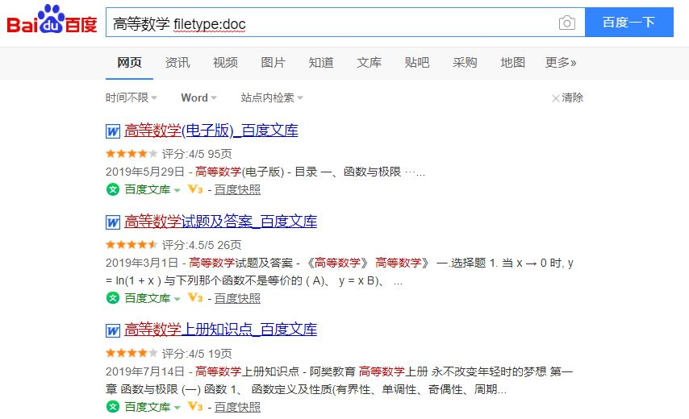
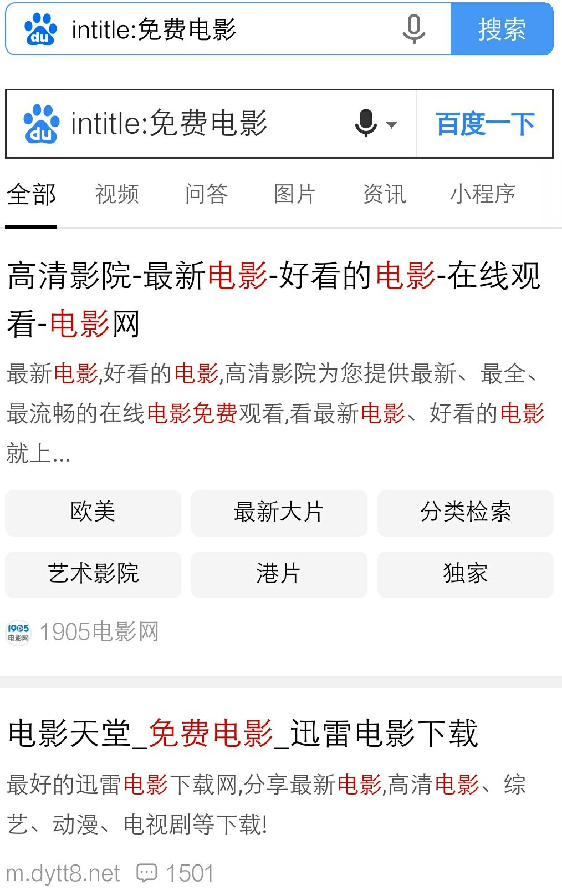
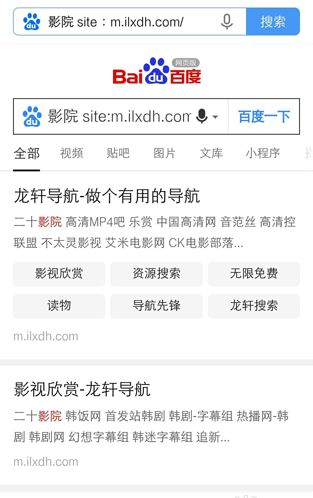
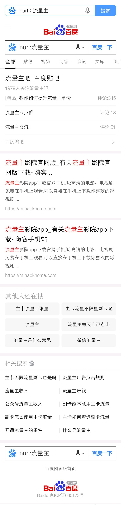

### **"" 《》 ：**

​	**把内容放里面，可以提高搜索精确度**

### **内容+内容：**

​	**搜索包含特定的词**

### **内容（空格）―不想看到的相关内容标题：**

​	**减号语法可以排除某些含有你要排除的标题网站**

### **内容 filetype:+文档格式**。

​	精准搜索你要的文档类资料

### **intitle:内容 ：**

​	**把搜索内容限定在网页标题中**

### **内容site：站点 ：**

​	**限定在某个网站的内容搜索**

### **inurl：内容 ：**

​	**搜索链接网站包含这个内容的标题网站**

