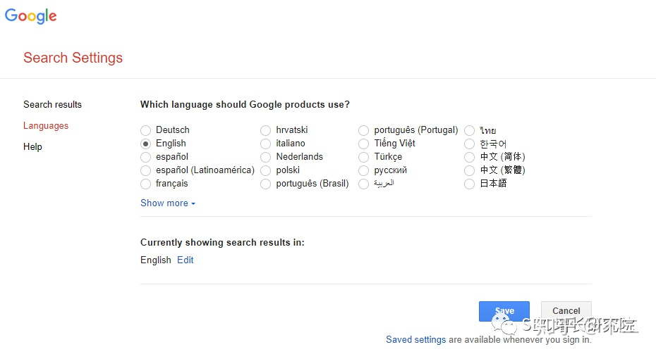
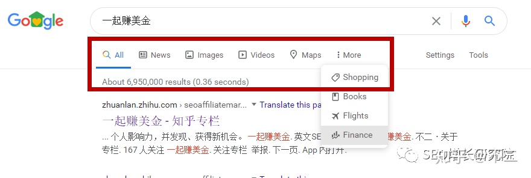
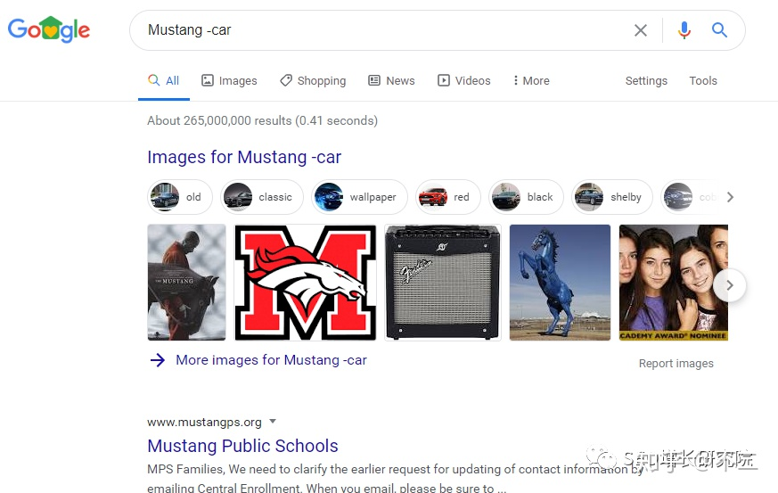
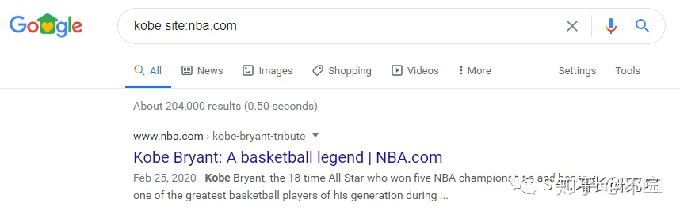
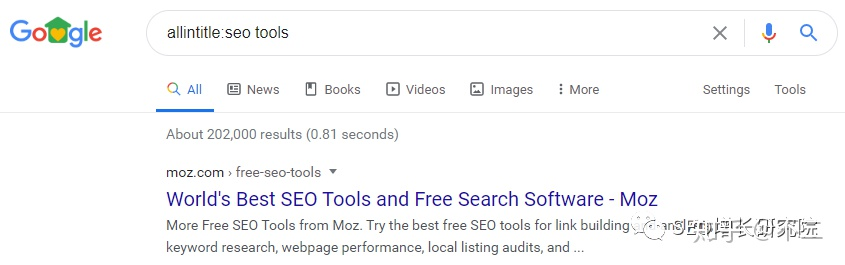
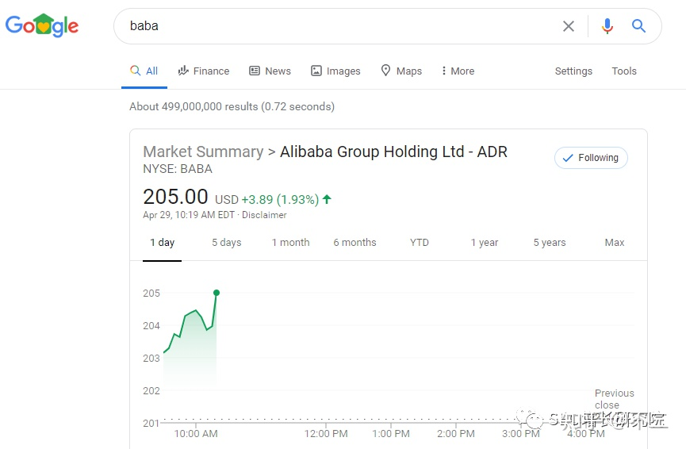
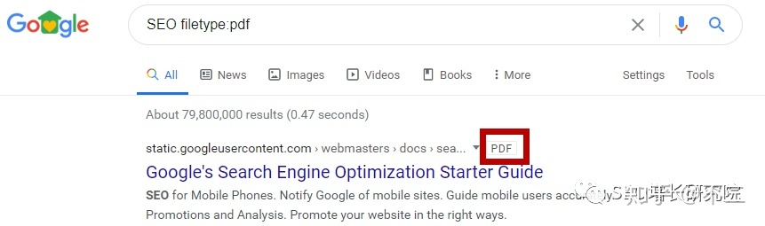

基本上每个人每天都在用搜索引擎，但是真正能够把搜索用好的人并不多。

过去图书馆是我们的主要信息来源之一，今天互联网已经成为比图书馆更为重要的信息来源。但是互联网中储存着海量信息，并不是每个人都有能力从中找到对自己真正有价值的内容。
同样的一个话题，搜索能力差的人，找到的要么是广告，要么是过时已久的信息；而搜索能力强的人，通过一些简单的指令就能找到关键所在。
**与其说是搜索，不如说是筛选，我们通过搜索引擎，从整个互联网中筛选出对自己有价值的信息和资源。**
很多人在遇到问题时第一反应就是马上请教别人，但是先通过搜索来尝试获取对问题的初步认识，再带着从搜索中获得的认知去和别人交流，这样效率更高，自己理解地也更深刻，同样也是尊重对方的表现，节省大家的时间。
而且很多问题，我们直接去问搜索引擎远比请教那些所谓的专家来得准确还更有效率。
近些年，全球各大搜索引擎，尤其是谷歌，在AI技术上的投入，让搜索变得更简单，也更了解我们；再加上搜索指令的运用，会让你的搜索效率更上一层楼。
作为Google SEOer的我们, 对于谷歌搜索指令的了解和运用是基本要求。今天就来介绍18种常用的谷歌搜索指令和技巧，很简单，几分钟就能学会，但是我相信这几分钟里学到的东西用终身受用这四个字来形容都不过分。

### **1. 使用正确的网址**

虽然我们在浏览器中输入的网址都是[http://www.google.com](http://www.google.com/)但是谷歌依然会根据你所在地理位置进行跳转，比如[http://www.google.com.hk](http://www.google.com.hk/)，[http://www.google.fr](http://www.google.fr/)等，搜索的结果也大不相同。
如果你想了解原汁原味的谷歌搜索，可以在search setting中把地区和语言都设置到美国。

### **2. 谷歌自带tabs**

在搜索栏下，通常会看到图片、新闻等tabs，使用这些选项卡，可以帮你快速进行定向搜索。
如果你需要图像片，就点images；如果你正在查找最近的新闻，就点news，可以大大缩短搜索时间，准确找到你想要的结果。

### **3. 双引号“”**

在搜索指令当中，引号是完全匹配的意思。当你搜索特定内容时，使用引号会降低Google对于你搜索意图的猜测，更精准地找到完全匹配的内容。
例如，如果你搜索Puppy Dog Food，谷歌会以任意顺序搜索包含这三个词的内容。
然而，如果搜索“Puppy Dog Food”，就是以这样的固定的排序去精准匹配你需要的信息。

### **4. 连字符 -**

使用连字符或者减号，可以帮你缩小搜索范围，因为很多词有多重含义。
比如，当你谷歌搜索Mustang时，你可能会找到福特汽车或马的结果，大部分是关于汽车的。

如果你只想找关于马的内容，使用连字符可以让谷歌忽略关于汽车的信息。
Mustang -car

### **5. site:[http://xxx.com](http://xxx.com/)**

我们会经常遇到这样的情况，需要在某个网站上找特定的信息。
指令非常简单，site:[http://xxx.com](http://xxx.com/)就能让谷歌把搜索范围定位在这个网站以内。
比如，Kobe site:[http://nba.com](http://nba.com/)，只在[http://nba.com](http://nba.com/)这个网站上搜索关于科比的内容。

如果你需要在特定的网站上查找特定的内容，这是最有效的方法。

### **6. link:[http://xxx.com](http://xxx.com/)**

这个指令不是搜索特定的页面，而是搜索链接到特定页面的页面。
如果你想反查竞争对手网站的外链来源，也就是哪些网站引用你的竞争对手的内容，可以使用这个指令找到他们。
比如，link:[http://backlinko.com](http://backlinko.com/)找到的结果就是所有链接到[http://backlinko.com](http://backlinko.com/)的页面。

### **7. \* 星号通配符**

当你在搜索时使用星号*，会留下一个占位符，谷歌会根据数据库信息自动填充星号所替代的内容。
比如你想不起完整的歌词，使用通配符是找歌词的好方法。
“Come * right now * me”
你会发现是甲壳虫乐队的Come Together这首歌。

### **8. related:[http://xxx.com](http://xxx.com/)**

比如你有一个喜欢的网站，想找到更多相似的网站，可以用这个指令，related:[http://amazon.com](http://amazon.com/)
你不会找到亚马逊，但是会找到类似亚马逊这样的在线商城，比如，Barnes & Noble, Walmart等等。

### **9. 使用谷歌搜索进行计算**

如果你手头找不到计算器，可以直接在谷歌搜索里输入进行计算。
结果中会显示一个科学计算器，可以用它进行更高级的计算。

### **10. AND**

AND这个指令，其实我们一直在用，只是没有意识，一般用空格代替，还可以用加号+代替，意思是逻辑“与”
比如，搜索SEO+SEM，查找的网页中会同时包含这两个关键词。

### **11. 搜索数字范围 ..**

对金钱或统计数据感兴趣的人会发现这个指令（两个点）特别有用。
你使用两个点和数字让谷歌知道你正在查找特定范围的数字。
比如
who won the world Cup ..2002

只有一个数字和两个点是告诉谷歌，只找2002这一年的结果，其他都不需要。
89..91
告诉谷歌只查找89到91之间的数字，这有助于我们缩小搜索范围，节省时间。

### **12. intitle和inurl**

拆开看就是in title和in url
intitle:SEO，这个指令代表只搜索文章标题中包含SEO这个词的结果。
inurl:SEO，代表只搜索文章URL链接中包含SEO这个词的结果。
注意冒号后面只能添加一个关键词，如果超过一个，整个搜索指令失效。

### **13. allintitle和allinurl**

拆开看是all in title和all in url
指令含意和intitle及inurl一样，区别在于intitle和inurl后面只能添加一个关键词。
allintitle和allinurl后面能添加多个关键词或者短语。

### **14. 搜索快捷方式**

谷歌还有很多搜索快捷方式，当你想查一个城市当地的时间和天气，比如北京，可以直接搜索：
time beijing
weather beijing
输入美股股票代码可以直接查看即时股价

还可以输入任何UPS、USPS或Fedex的运单号，谷歌会直接显示快递信息。
还能单位换算，比如英里换算公里，miles to KM, 美元与人民币汇率等等。

还有更多，比如航班信息、体育赛事结果、食品营养成分表等等。

### **15. filetype:**

如果你需要查看特定的文件格式，比如PDF或PPT等，filetype指令可以快速帮你定位。比如，
SEO filetype:pdf

找到的所有结果都是与SEO相关的PDF文件。

### **16. define:**

如果你遇到不理解的单词，使用define指令，谷歌会告诉你的它的含义及发音等，注释内容来自牛津辞典。

### **17. timer**

如果你需要计时，但是手机不在身边，直接搜索时间+timer, 到时谷歌会自动提醒你。

### **18. 只使用重要的单词**

谷歌的工作方式是将你搜索的内容与索引数据库中的内容关键字进行匹配。
虽说谷歌现在很强大，能理解我们人与人之间的正常对话，但是当你搜索太多词时，可能会找到很多不相关的结果，需要更多的时间去筛选。
所以当我们搜索时，只使用重要的词效果会更好。
比如，Where can I buy n95 masks？(我在哪里能买到N95口罩?)
不妨试试n95 masks nearby或者n95 masks near me
**尽量使用网络中的专业术语，这会帮助我们找到更可靠的结果。**
**谷歌是一个非常强大的工具，学会与它做朋友。**